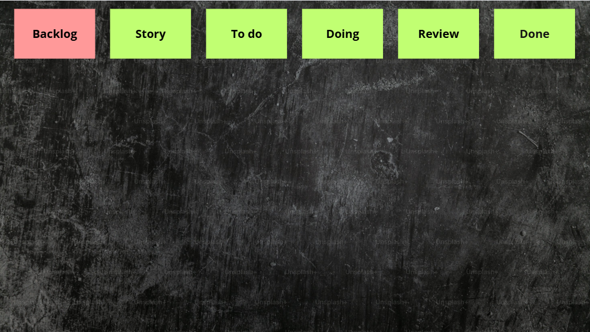
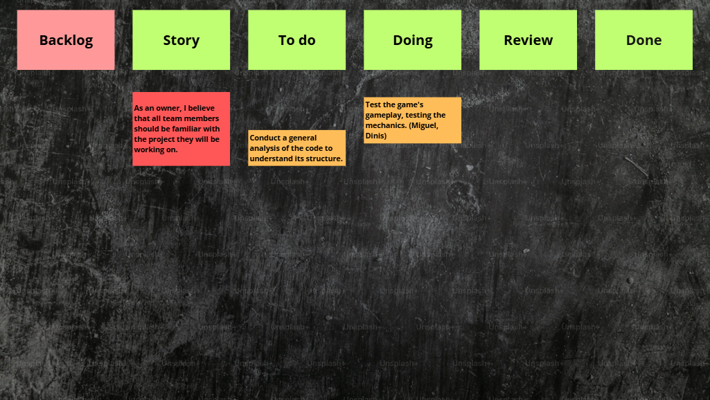
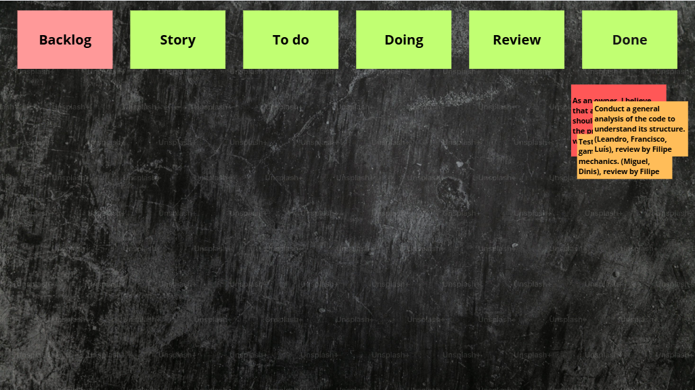
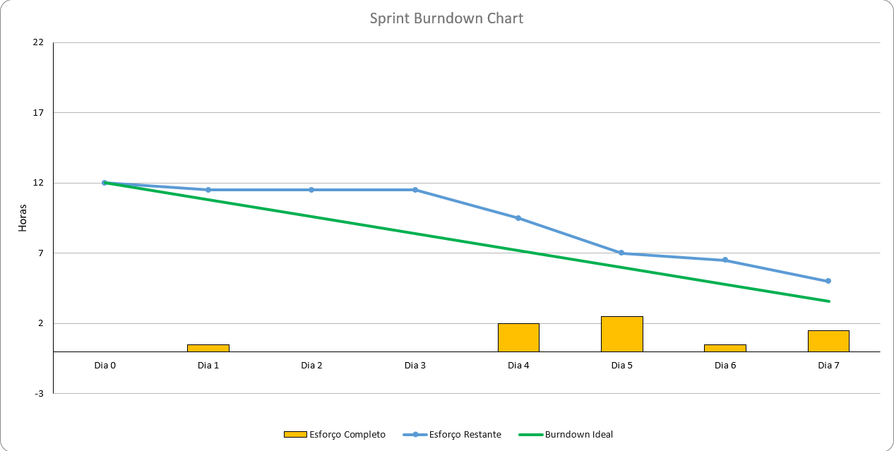
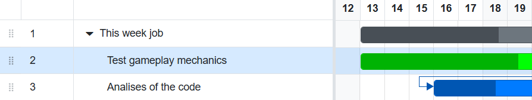

# Sprint 1

## Dates

2025-10-08 - 2025-10-19

## Scrum master

Filipe Nobre 67850

## Management info
### Sprint Planning Meeting:
During this meeting, we decided that over the course of this week we will explore the functionalities of the game and analyze which parts of the code are responsible for specific features. The goal is to gain a clear understanding of the program's main structure, which will make it easier to implement new features in the future.
### Sprint Review Meeting:
All members of the team made their work and is notable that all of them are now more into the project understanding the code and the way it works.

### Sprint Retrospective Meeting:
We concluded that, although we worked well during the week, our progress did not meet our expectations. We all understand that next week will be crucial to recover the time lost and make significant progress.

## Relevant resources

### Scrum Board at the beginning of the sprint

### Scrum Board in the middle of the sprint

### Scrum Board at the end of the sprint

### Burndown Chart for the sprint

### Gantt Chart

