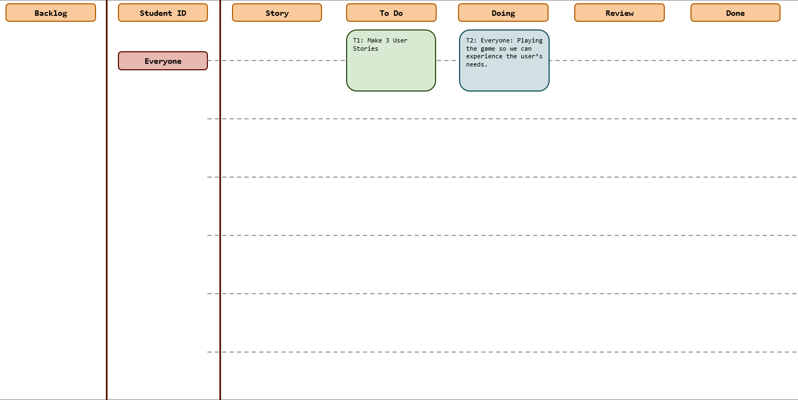
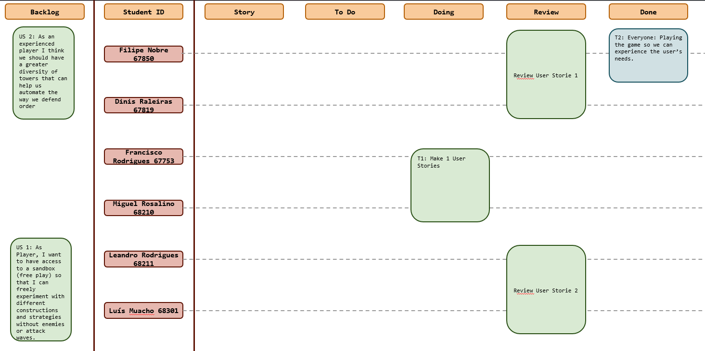
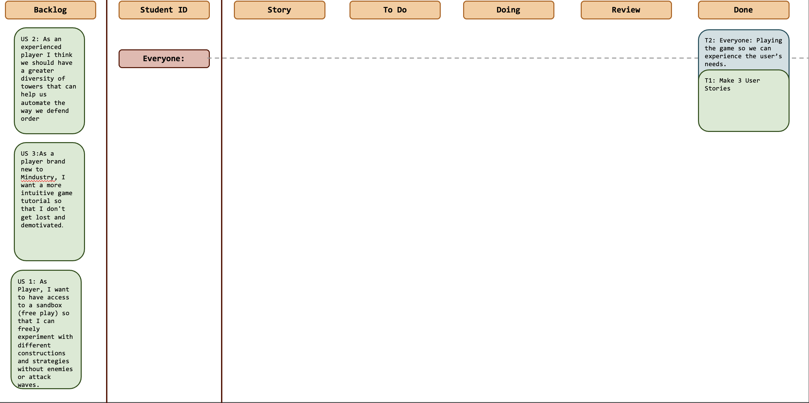

# Sprint 2

## Dates

2025-10-20 - 2025-10-26

## Scrum master

Dinis Raleiras 67819

## Management info
### Sprint Planning Meeting: 
At the beginning of this week, the Scrum team met to plan and organize the work related to the Mindustry repository extension. Since this is a particularly busy week for all team members due to multiple tests and academic deadlines, the main focus of the meeting was time management and task organization rather than feature definition. 
During the meeting, the team decided the following:
- The **Scrum Master** was chosen and assigned the responsibility of managing deadlines and overseeing team coordination.
- The **remaining members** will continue exploring the Mindustry game and developing potential **user stories** for the upcoming sprint.
- Once these user stories are completed, the team will meet again to **decide who reviews what** and ensure quality before implementation.
### Sprint Review Meeting: 
*This week was quite busy for everyone, with several tests and academic deadlines, so we had to manage our time carefully. Even though the overall time spent on the sprint was well balanced, most of the work ended up happening later in the week rather as an even spread throughout the days.
Throughout the sprint, we focused on exploring the Mindustry game, understanding its structure, and preparing user stories for future development. While there weren’t many visible features yet, the groundwork for the next sprint was successfully set.
Looking at the burndown chart, we could see that progress was slower at the start and picked up significantly towards the end. The team managed to stay on track overall, but we agreed that it would be better to distribute the workload more evenly in future sprints to avoid last-minute rushes.
Overall, the sprint went well considering the busy schedule — we learned more about the project and stayed coordinated.)*

### Sprint Retrospective Meeting: 
*What went well:
- We stayed coordinated and communicated often despite the busy week.
- Everyone contributed and helped push things forward near the end.
- We learned a lot about the Mindustry project and defined a clearer path for next sprint.  
 

What could be improved:
- Try to balance the workload better across the week instead of saving most of it for the last days.
- Plan around academic weeks to avoid last-minute stress.

## Relevant resources

### Scrum Board at the beginning of the sprint

### Scrum Board in the middle of the sprint

### Scrum Board at the end of the sprint

### Burndown Chart for the sprint

[Burndown Chart Sprint 2](./Burndown_Chart_Sprint_2.xlsx)

### Gantt Chart
[Gantt Chart Sprint 2](./Gantt_Chart_Sprint_2.xlsx)

