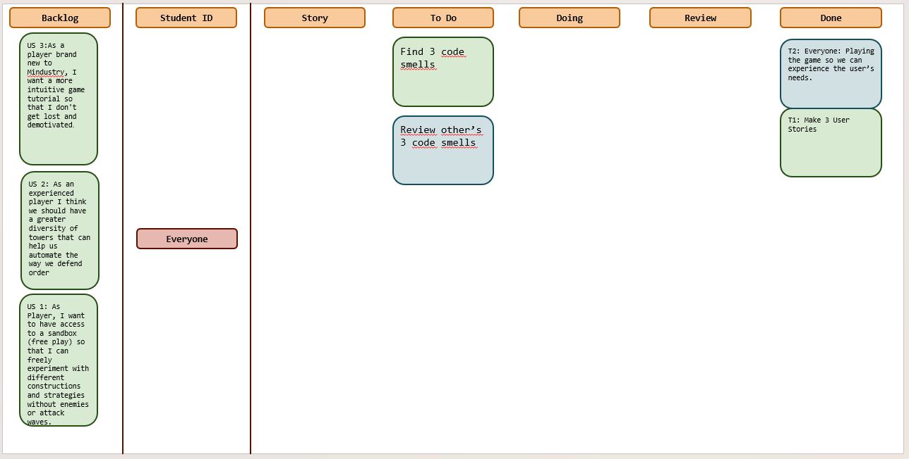
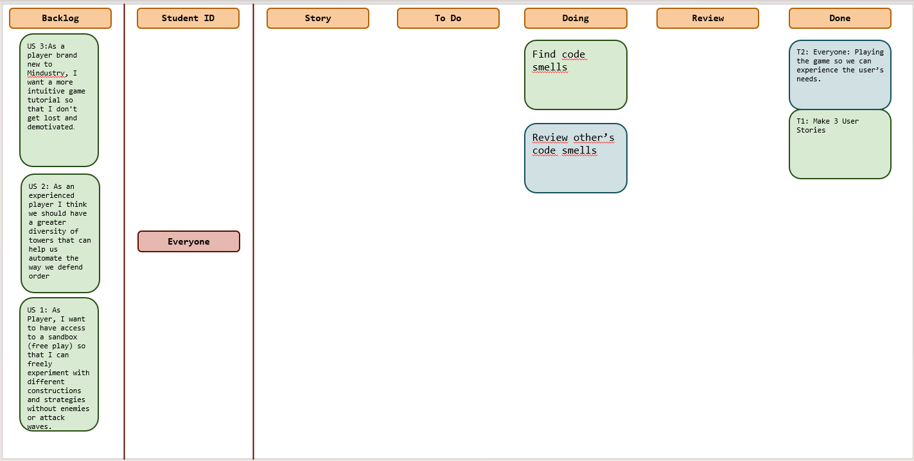
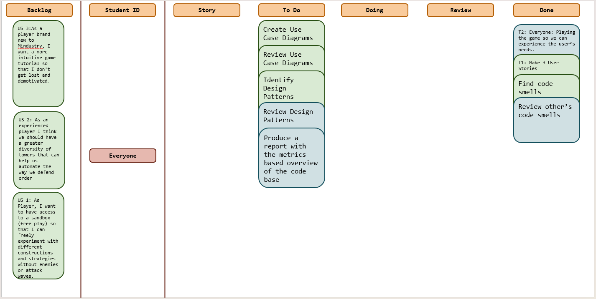
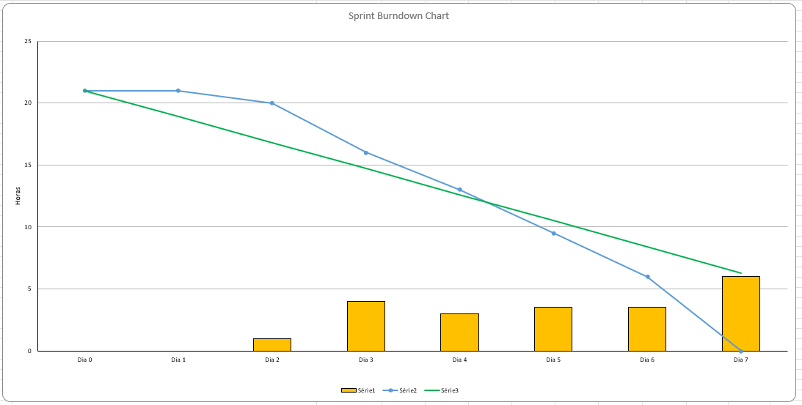
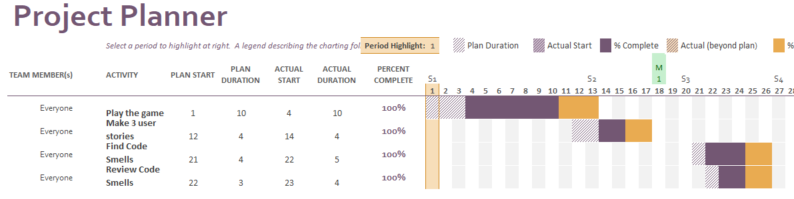

# Sprint 3

## Dates

2025-10-27 - 2025-11-02

## Scrum master

Luís Muacho 68301

## Management info
### Sprint Planning Meeting: 
In our meeting this week, we defined the following work for this sprint.
Unfortunately this sprint overlaps with academics tests period. To mitigate this risk, we agreed that if any of us have a delay due to tests must be communicated immediately so the team can adapt and redistribute tasks if necessary. For the same reason we decided to do just the tasks related with code smells.

Tasks:
- each member will identify and document 3 code smells;
- each member will review 3 code smells from 3 different colleagues;

### Sprint Review Meeting: 
This was a challenging sprint. We had a slow start, with effective work only beginning on Wednesday, due to external constraints on the team—namely other assignments and academic tests that required the attention of several members. However, despite these obstacles and the compressed timeline, the team managed to focus, and the main sprint goal was achieved. All the code we set out to analyze was, in fact, reviewed and validated.

### Sprint Retrospective Meeting: 
**What went well:** The most positive point is that, despite all the difficulties, we met the final objective. Once we finally managed to get started, there was good focus, and all the planned work was reviewed and analyzed. We showed resilience and an ability to deliver, even under pressure.

**What went wrong (and needs improvement):** Our biggest problem was the process. The late start on Wednesday, combined with external blockers (other assignments and tests), created very inconsistent work paces. Each member was working at a different speed. This inconsistency had a direct consequence: we failed one of our own process goals. We had defined that a member's code smell reviews should be done by different members to ensure a diversity of opinions. Due to time pressure and irregular availability, this did not happen
## Relevant resources

### Scrum Board at the beginning of the sprint

### Scrum Board in the middle of the sprint

### Scrum Board at the end of the sprint

### Burndown Chart for the sprint

### Gantt Chart

