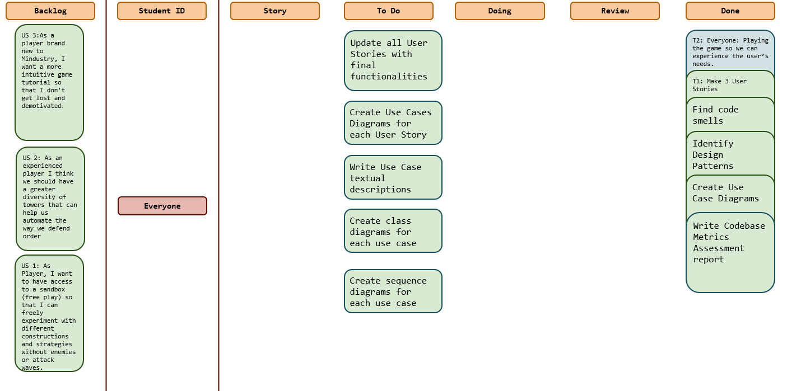
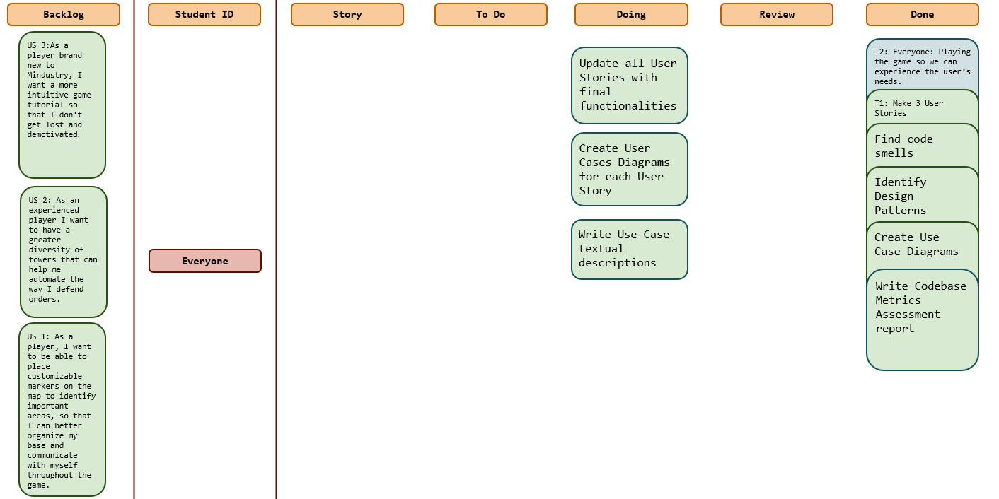
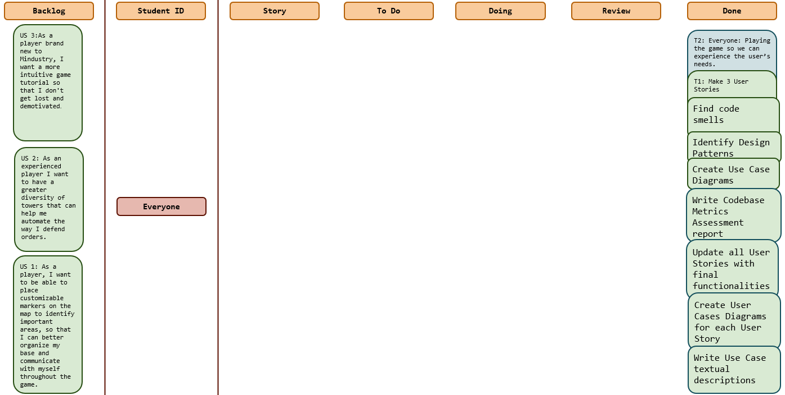
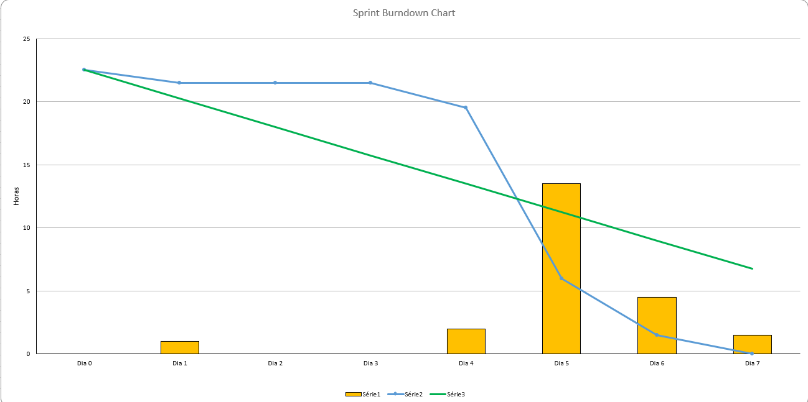
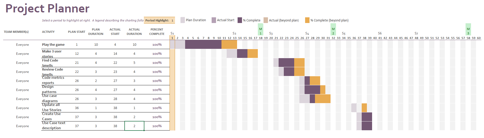

# Sprint 5

## Dates

2025-11-10 - 2025-11-16

## Scrum master

Leandro Rodrigues 68211

## Management info
### Sprint Planning Meeting: 
At the beginning of this week, the Scrum team met to plan and organize the first sprint of Milestone 3, focusing on the
preparation of the design and documentation required before code implementation. Since this milestone will last three weeks,
the team decided to dedicate this first sprint mainly to updating user stories and designing the system extensions at a high level.

During the meeting, the team decided the following:

- This week’s focus will be on:
  - Updating the user stories to reflect the new functionalities that will be implemented;
  - Creating the use case diagrams and their textual specifications following the lecture template;
  - Start planning how each team member will implement their assigned User Story.

No code implementation will be done during this sprint. The goal is to ensure all documentation and designs are ready for development in the next sprint.

### Sprint Review Meeting: 
At the end of this sprint, the team met to evaluate the progress made during the first week of Milestone 3.
The goal for this sprint was to complete all high-level design and documentation tasks before moving into code implementation next week — and the team successfully achieved all planned activities.

During the review, the following outcomes were confirmed:

 - All user stories were updated to reflect the new functionalities that will be implemented during Milestone 3.

 - All use case diagrams and their textual specifications were created.

 - Initial planning for how each team member will implement their assigned User Story was completed.

The sprint goal was fully accomplished, and all deliverables scheduled for this week were completed on time.
### Sprint Retrospective Meeting: 
The team reflected on the work done this week and agreed that the sprint went smoothly.
All tasks were completed on time, communication was clear, and everyone contributed consistently. For the next sprint, the team will keep the same communication flow and make sure to clear up any doubts about the 
implementation as soon as they appear.
Overall, the team feels prepared and aligned for the development phase starting next week.
## Relevant resources

### Scrum Board at the beginning of the sprint

### Scrum Board in the middle of the sprint

### Scrum Board at the end of the sprint

### Burndown Chart for the sprint

### Gantt Chart

