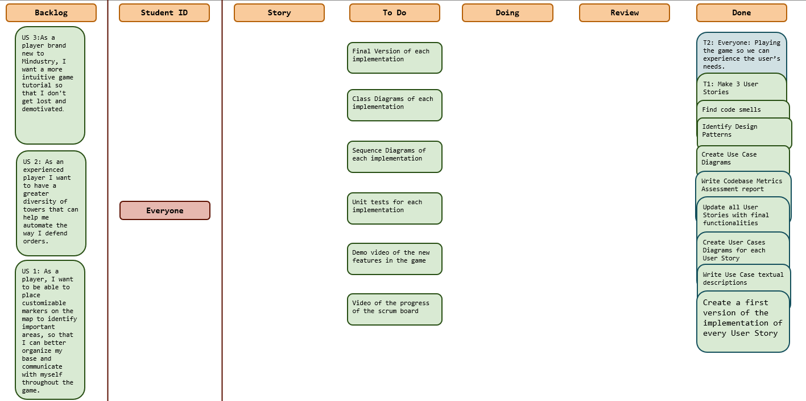
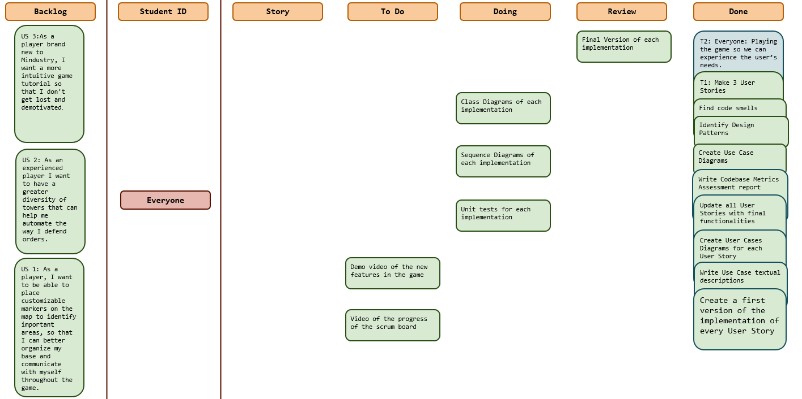

# Sprint 7

## Dates

2025-11-24 - 2025-12-04

## Scrum master

Filipe Nobre 67850

## Management info
### Sprint Planning Meeting: 
In the meeting we discuss overall about what are we going to focus this week since this is the last week to have the job done.
So we define that this week we will:
- Implement the final version of each implementation
- Do the class and sequence diagrams of each implementation
- Do the unit tests for each implementation
- Do the videos of the scrum board progress over the project and the video od the new features.

### Sprint Review Meeting: 
*(Held at the end of the sprint, this meeting is attended by all stakeholders to demo the completed work and validate if the sprint goal has been met.)*

### Sprint Retrospective Meeting: 
*(This meeting happens after the sprint review and before the next sprint planning meeting. The team reflects on what went well, what needs improvement, and how to enhance their processes for future sprints.)*

## Relevant resources

### Scrum Board at the beginning of the sprint

### Scrum Board in the middle of the sprint

### Scrum Board at the end of the sprint

Please add the scrumboard picture here.

### Burndown Chart for the sprint

Please add the burndown chart here.

### Gantt Chart

Please add the Gantt chart here.
