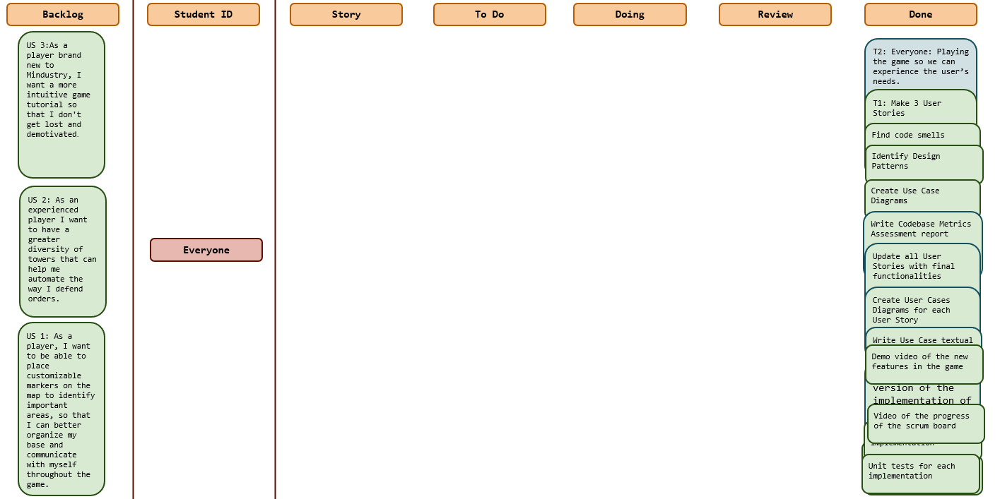
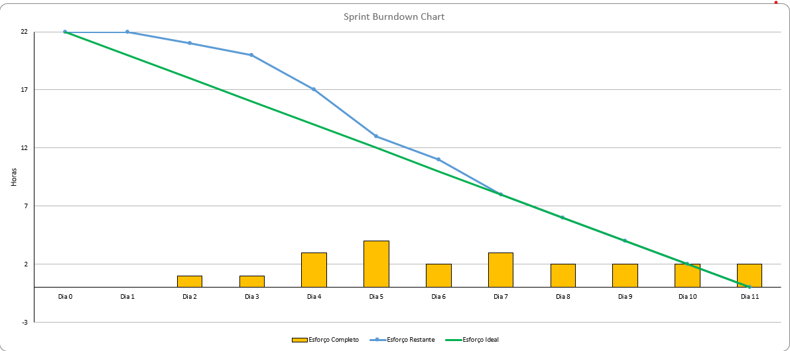
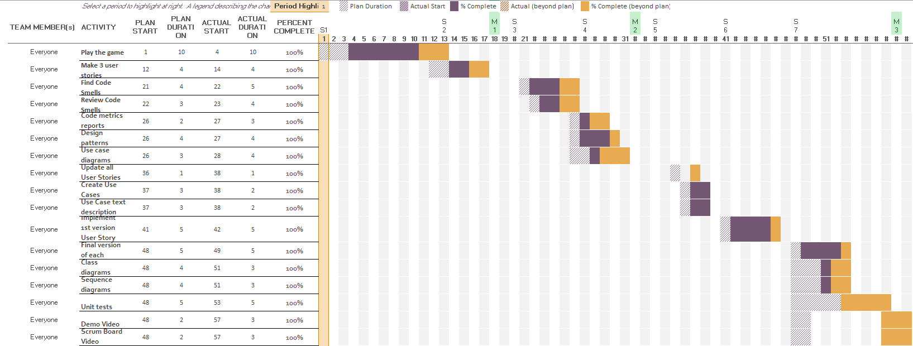

# Sprint 7

## Dates

2025-11-24 - 2025-12-04

## Scrum master

Filipe Nobre 67850

## Management info
### Sprint Planning Meeting: 
In the meeting we discuss overall about what are we going to focus this week since this is the last week to have the job done.
So we define that this week we will:
- Implement the final version of each implementation
- Do the class and sequence diagrams of each implementation
- Do the unit tests for each implementation
- Do the videos of the scrum board progress over the project and the video od the new features.

### Sprint Review Meeting: 
Sprint 7 has come to an end, and the team gathered to evaluate the progress made throughout the week and to verify whether the defined goals were successfully achieved.

At the start of the sprint, we established five main objectives to guide the work for the week. Although the sprint began with a slow and less productive pace, the team gradually improved its momentum, regained focus, and increased efficiency as the days went on.

By the end of the sprint, all five objectives were successfully completed. The planned tasks were finished, and the expected functionalities were implemented in their initial working versions. While some of them may still require refinement in future iterations, everything is currently in a functional and demonstrable state.

During the review session, we walked through each completed objective and showcased the progress made, ensuring shared visibility and alignment across the team.

### Sprint Retrospective Meeting: 
Looking back at Sprint 7, the team reflected on the final stage of the project, evaluating what went well, what could still be improved, and how we can carry these lessons into future work.

This sprint was particularly focused and outcome-driven. Since it was the last sprint of the project, the team worked with a clear mindset: finalize all remaining goals and ensure the product reached a stable, functional, and complete state. Despite the week starting slower than expected, productivity steadily increased, and by mid-week the team had regained strong momentum.

One of the highlights of this sprint was the team’s ability to stay coordinated while handling the last layers of implementation, adjustments, and polishing. Collaboration remained strong, and the shared understanding built over the previous sprints made the final integration efforts much smoother. All five objectives set for the week were successfully completed.

Still, the team noted that some improvements could be made for future projects—particularly in maintaining consistent communication and ensuring that initial planning leaves less room for ambiguity. Even though communication worked well overall, there is always space to refine how we share updates and anticipate dependencies.

As this sprint marks the completion of the project, the team feels satisfied with the results and proud of the steady evolution throughout all iterations. Sprint 7 not only brought the project to a successful closure but also highlighted how much the team has grown in collaboration, efficiency, and problem-solving.

Overall, Sprint 7 was a strong finish and a meaningful conclusion to the project.

## Relevant resources

### Scrum Board at the beginning of the sprint

### Scrum Board in the middle of the sprint

### Scrum Board at the end of the sprint

### Burndown Chart for the sprint

### Gantt Chart

