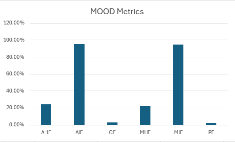

# MOOD Metrics

## Explanation of MOOD Metrics

The **MOOD metrics** (*Metrics for Object-Oriented Design*) are a set of software quality indicators designed to measure how well an object-oriented system follows key design principles such as **encapsulation**, **inheritance**, **coupling**, and **polymorphism**.

They provide a quantitative view of the system’s structure, helping identify design problems that may affect **maintainability**, **reusability**, and **complexity**.

| **Metric** | **Full Name** | **What It Measures** | **Interpretation** |
|-------------|----------------|----------------------|--------------------|
| **MHF** | *Method Hiding Factor* | Degree of **encapsulation** of methods | Higher values indicate better encapsulation (more private/protected methods). |
| **AHF** | *Attribute Hiding Factor* | Degree of **encapsulation** of attributes | Higher values indicate that attributes are well hidden (fewer public fields). |
| **MIF** | *Method Inheritance Factor* | Degree of **inheritance reuse** for methods | Higher values indicate that more methods are inherited rather than newly defined. |
| **AIF** | *Attribute Inheritance Factor* | Degree of **inheritance reuse** for attributes | Higher values indicate that attributes are often inherited, showing code reuse. |
| **PF** | *Polymorphism Factor* | Degree of **polymorphism** used in the system | Higher values indicate greater use of method overriding and dynamic behavior. |
| **CF** | *Coupling Factor* | Degree of **interdependence** between classes | Higher values indicate stronger coupling (less modular and harder to maintain). |

### Desired Values

- **High MHF / AHF** → Good encapsulation; classes protect their internal state.
- **High MIF / AIF** → Indicates inheritance and reuse, but excessive values can mean deep hierarchies and fragile designs.
- **High PF** → Shows use of polymorphism, improving flexibility and extensibility.
- **Low CF** → Indicates low coupling, meaning classes are more independent and easier to maintain.

**In general:**  
A well-designed object-oriented system aims for **high encapsulation and reuse** (`MHF`, `AHF`, `MIF`, `AIF`, `PF`) and **low coupling** (`CF`).

## Project Results
| **Metric** | **Value (%)** |
|-------------|---------------|
| **AHF** | 24.27 |
| **AIF** | 95.59 |
| **CF**  | 3.11 |
| **MHF** | 22.14 |
| **MIF** | 94.64 |
| **PF**  | 2.58 |

## Analysis

### Encapsulation (MHF, AHF)

-**AHF (Attribute Hiding Factor) – 24.27%**

This metric measures how well attributes are hidden from external access.
A value of 24.27% is relatively low, indicating that most attributes are publicly accessible rather than private or protected.
This suggests that the project has weak encapsulation at the attribute level — meaning internal data can be directly accessed or modified by other classes. Such exposure increases coupling and decreases data integrity, making the system harder to maintain and more error-prone.

-**MHF (Method Hiding Factor) – 22.14%**

This metric measures how many methods are hidden (not publicly accessible).
A value of 22.14% is also quite low, which means most methods are public and accessible to other classes.
While some public methods are necessary for functionality, excessive visibility can expose internal behaviors that should remain private. This again indicates poor encapsulation, as classes reveal too much of their internal logic.

### Inheritance (MIF, AIF)

-**AIF (Attribute Inheritance Factor) – 95.59%**

This metric indicates the percentage of attributes inherited from parent classes.
With a value of 95.59%, almost all attributes are inherited rather than declared locally.
This again reflects heavy reliance on inheritance for reuse, which can be positive in well-structured hierarchies.
However, excessive inheritance often reduces encapsulation and independence of subclasses, forcing them to depend on the structure and state of their parents.

-**MIF (Method Inheritance Factor) – 94.64%**

This metric represents the percentage of methods inherited from parent classes rather than defined in the class itself.
A very high value (94.64%) indicates extensive use of inheritance, meaning most methods are reused from superclasses.
While this shows strong code reuse, it can also imply deep inheritance hierarchies.
Such hierarchies may:
- Increase complexity, since changes in base classes affect many subclasses;
- Reduce flexibility, as tightly coupled hierarchies are harder to modify;
- Lead to fragile base class problems if not carefully designed.

### Polymorphism (PF)

-**PF (Polymorphism Factor) – 2.58%**

This metric measures the degree of polymorphism in the project — specifically, the proportion of overridden methods (those redefined in subclasses) compared to all methods that could be overridden.
A PF value of 2.58% is very low, indicating that polymorphism is rarely used in this codebase.
In other words, while the project uses inheritance heavily (as shown by the high MIF/AIF values), it does not take full advantage of dynamic method overriding — subclasses mainly inherit behavior without redefining or extending it.

### Coupling (CF)
-**CF (Coupling Factor) – 3.11%**

This metric represents the ratio of actual couplings (connections or dependencies between classes) to the maximum possible couplings in the system.
A CF value of 3.11% is very low, meaning that classes in the project are mostly independent and do not rely excessively on one another.
This is a positive indicator: it suggests that the system has low coupling, which enhances modularity, readability, and maintainability.

## Potencial Trouble Spots
### Interpretation
The **extreme values** in the inheritance-related metrics (**AIF** and **MIF**) suggest that the system relies heavily on class hierarchies.  
Combined with the **low encapsulation metrics** (**AHF** and **MHF**) and **low polymorphism (PF)**, this indicates that:
- Classes share a lot of inherited structure but expose too much of their internal state.
- The design may suffer from *fragile base class* problems or *tight inheritance coupling*.
- There is limited behavioural flexibility due to the lack of polymorphism.

Despite these issues, the **low coupling factor (CF)** is a strong positive indicator — it shows that, while hierarchies may be deep, **dependencies between classes remain low**, preserving modularity.

###  Conclusion of Trouble Spots
- **Weak encapsulation** → AHF and MHF are very low.
- **Overuse of inheritance** → AIF and MIF are extremely high.
- **Underuse of polymorphism** → PF is very low.
- **Coupling** → CF is well controlled and not a concern.

## Relation Between MOOD Metrics and Code Smells We Identified

The collected MOOD metrics provide useful insights into the structural quality of the codebase and show partial alignment with the detected code smells.

- The **low encapsulation metrics** (AHF = 24.27%, MHF = 22.14%) are consistent with the presence of **Data Class** and **Inappropriate Intimacy** smells, which often occur when classes expose too many public attributes or share internal data directly.
- The **very high inheritance metrics** (AIF = 95.59%, MIF = 94.64%) may relate to **Feature Envy** and **Shotgun Surgery**, as deep inheritance hierarchies can increase inter-class dependencies and make changes propagate across multiple files.
- The **low polymorphism factor** (PF = 2.58%) suggests limited behavioral flexibility, which may indirectly support the occurrence of **Long Method** and **Message Chaining**, as these smells appear in codebases where reuse and abstraction are not well utilized.
- The **low coupling factor** (CF = 3.11%) indicates that coupling between modules is generally well controlled, so not all identified smells (e.g., **Data Clumps** or **Long Parameter List**) are directly reflected in the metrics.

Overall, the MOOD metrics confirm several design weaknesses related to encapsulation and inheritance but do not capture all types of code smells, especially those related to method complexity or data grouping.

