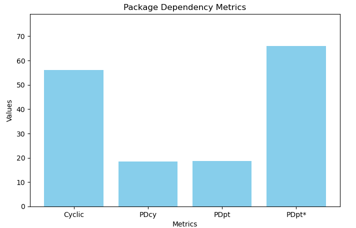
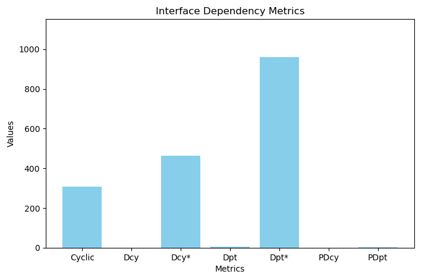
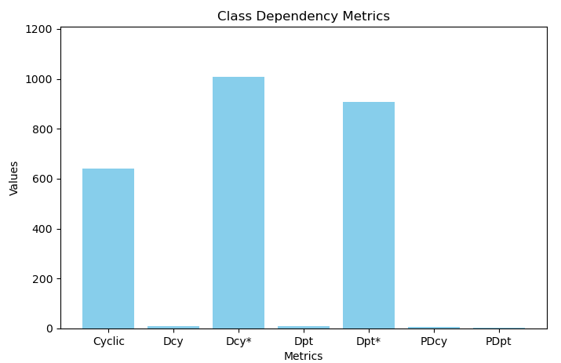

# Dependency Metrics

## Explanation of Dependency Metrics

**Dependency Metrics** measure the coupling between components in a software system — essentially, how much one 
component depends on others and how much other components depend on it.

They are useful to detect:
- **High coupling** → Changes in one component may break others.
- **Critical components** → Many parts of the system depend on them.
- **Potential design issues** → Circular dependencies, low modularity.

___

## Specific Metrics

| Metric               | Meaning                                                                                 | What it indicates                                                                                                                        |
|----------------------|-----------------------------------------------------------------------------------------|------------------------------------------------------------------------------------------------------------------------------------------|
| Cyclic               | Measures if there is a **cycle in dependencies** (e.g., A->B->C->A)                     | Cyclic dependencies make the system harder to maintain and refactor                                                                      |
| PDcy (Package Dependency Cycle) | Number of **cycles at the package level**                                               | High PDcy → tightly coupled packages, modularity problem                                                                                 |
| PDpt (Package Dependency path) | Number of **dependency paths from this package to others**                              | High PDpt → the package relies on many other packages                                                                                    |
| PDpt*                | Weighted of transitive versions of PDpt (counts **indirect dependencies** as well)      | Shows total reach of dependencies, including indirect ones                                                                               |
| Dcy (Dependency Cycle) | Number of **direct dependency cycles** a unit (class/interface/package) participates in | Indicates **tight coupling** and **circular dependencies**, making maintenance difficult                                                 |
| Dcy*                 | Number of **all (direct + indirect)** cycles a unit is involved in                      | Captures **transitive cycles**, showing the full impact of circular dependencies                                                         |
| Dpt (Dependency Path) | Number of **direct dependency paths** from this unit to others                          | High Dpt → the unit depends on many others directly; risky for modularity                                                                |
| Dpt*                  | Number of **all dependency paths (direct + indirect)**                                  | Shows the **total reach of dependencies**, including transitive ones, highlighting how much the unit can affect or be affected by others |

___

## Level of Analysis

### Package Level
Groups related classes. Metrics measure **cycles and dependency paths between packages** (Cyclic, PDcy, PDpt, PDpt*). High values indicate tight coupling and poor modularity.

### Interface level
Represents class contracts/APIs. Metrics (if available) show **critical interfaces and their dependency reach**. Helps reduce **propagation of changes**.

### Class Level
Focuses on individual classes. Metrics measure **cycles** (Cyclic, Dcy, Dcy*), **dependency paths** (Dpt, Dpt*), and **impact on packages** (PDcy, PDpt). Highlights highly coupled or risky classes.

___

### Package Level Metrics Analysis

The package-level dependency metrics provide insight into the overall **structure and coupling of the system**. The average values are:

| Metric         | Value | Interpretation |
|----------------|-------|----------------|
| Cyclic (56.10) |    High   |      More than half of the packages are involved in some form of dependency cycle, indicating that circular dependencies are widespread. This suggests that many packages are interdependent and changes in one package are likely to affect others.          |
| PDcy (18.57)   |    Moderate   |       On average, each package participates in approximately 18 direct dependency cycles. While not extreme, this indicates that cycles are common and that multiple packages are entangled in recurring dependency loops.         |
| PDpt (18.79)   |Moderate|         Each package depends directly on about 19 other packages. This shows a moderate level of direct coupling, where a package relies on a relatively large number of other packages for its functionality.       |
| PDpt* (65.93)  |   High    |          Considering direct and indirect dependencies, each package has a total dependency reach of nearly 66 packages. This means that a single package is connected, directly or indirectly, to a large portion of the system, highlighting the extensive propagation potential of changes.      |

### Interface Level Metrics Analysis

The metrics provide insight into the structure and coupling of interfaces in the system:

| Metric          |Value|Interpretation|
|-----------------|---|---|
| Cyclic (307.80) |  Very High |  Indicates a large number of interfaces are involved in cycles. This is extremely high compared to class/package levels, suggesting widespread circular dependencies at the interface level. |
| Dcy (1.14)      |Low| Each interface is involved, on average, in just over one direct dependency cycle. This suggests that while cycles are frequent across the system, any single interface typically participates in few direct cycles.  |
| Dcy* (462.73)   | Very High  |  Considering all direct and indirect cycles, each interface participates in hundreds of cycles on average, reflecting that transitive cycles are extremely widespread. |
| Dpt (6.10)      |  Low to Moderate |  Each interface has direct dependencies on ~6 other interfaces, indicating moderate direct coupling. |
| Dpt* (959.70)   |  Extremely High |  When considering transitive dependencies, each interface is indirectly connected to nearly 960 other interfaces on average, highlighting that interfaces are highly interconnected across the system. |
|       PDcy (0.90)          |  Low |  On average, each interface contributes less than one package-level cycle, indicating interfaces have limited contribution to package-level circular dependencies. |
|         PDpt (3.01)        | Low to Moderate  | Each interface affects ~3 other packages directly, showing a moderate influence on package-level dependencies.  |

### Class Level Metrics Analysis

These metrics give insight into the **coupling and dependency structure of individual classes**:

| Metric          | Value          |Interpretation|
|-----------------|----------------|---|
| Cyclic (640.29) | Very High      |  A very large number of classes are involved in dependency cycles. This indicates widespread circular dependencies across the system at the class level. |
| Dcy (10.01)     | Moderate       |  On average, each class participates in about 10 direct dependency cycles, showing that individual classes are actively involved in cycles. |
| Dcy* (1007.69)  | Extremely High | Considering all direct and indirect cycles, each class is part of over 1,000 cycles on average, reflecting extensive transitive circular dependencies.  |
| Dpt (8.33)      | Moderate       | Each class depends directly on about 8 other classes, indicating moderate direct coupling.  |
| Dpt* (909.11)   | Very High      | Each class indirectly depends on over 900 other classes on average, highlighting the far-reaching impact of changes in a single class.  |
|         PDcy (5.05)        | Moderate       | On average, each class contributes to ~5 package-level cycles, suggesting that class-level cycles significantly influence package-level coupling.  |
|            PDpt (3.52)     | Low to Moderate               | Each class affects ~3–4 other packages directly, indicating moderate influence on package-level dependencies.  |
