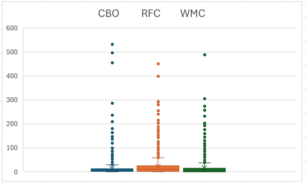
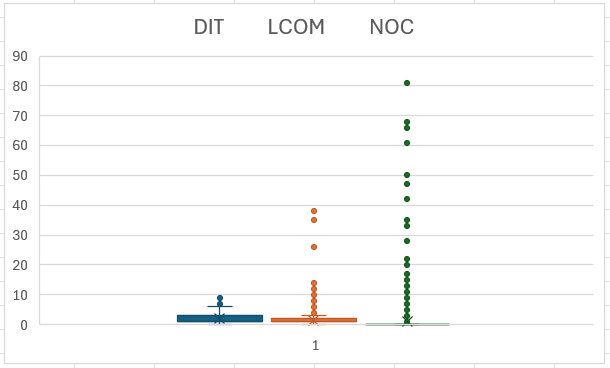

# Chidamber-Kemerer Metrics
Here we will analyze the quality of the design OO of the project, using the Chidamber-Kemerer metrics.

## Explanation of Chidamber-Kemerer Metrics

| **Metric** | **Full Name**                 | **What It Measures**                                                                      | **Interpretation**                                                                                      |
|------------|-------------------------------|-------------------------------------------------------------------------------------------|---------------------------------------------------------------------------------------------------------|
| **CBO**    | *Coupling Between Objects*    | Measure the **number of other classes** to which a class is "coupled".                    | Lower values indicate that the class is independent and modular.                                        |
| **DIT**    | *Depth of Inheritance Tree*   | Measure how deep a class is in the **inheritance hierarchy**.                             | Lower values indicate that the class is simpler to understand, because it has less inherited functionality. |
| **LCOM**   | *Lack of Cohesion in Methods* | Measures how well the **methods** of a class **"work together"**.                         | Lower values mean high cohesion. The class has a clear and well-defined purpose.                        |
| **NOC**    | *Number of Children*          | Counts the **number of subclasses** (children) that directly **inherit from this class**. | High values indicates high reuse, this class is an important abstraction.                               |
| **RFC**    | *Response For a Class*        | Counts the total number of methods an object of this class can respond to.                | Lower values mean that the class is simpler, easier to understand and test.                             |
| **WMC**    | *Weighted Methods per Class*  | Measures the overall **complexity of a class**.                                           | Lower values mean that the class is simpler, focused and easy to manage.                                |

## Desired Values

**Low CBO**: Low coupling and high modularity;

**Low DIT**: Simpler, less complex hierarchies;

**Low LCOM**: High cohesion and single responsibility;

**Low RFC**: Simpler and easier to test;

**Low WMC**: Simpler and less complex class;

**NOC** (Trade-off): High NOC means high reuse, but also a high-impact point fo change;

## Project Results
### Average Values
**These values aren't present in the CSV because the tool export didn't export together with the rest.**

|**Metric** |**CBO**|**DIT**|**LCOM**|**NOC**|**RFC**|**WMC**|
|------------|-------|-------|--------|-------|-------|-------|
| **Average**|15.33  |2.42   |1.66    |1.31   |23.89  |17.75  |

**Interpretation:**

The overall analysis reveals a design with excellent internal class cohesion (LCOM of 1.66), indicating good adherence to the Single Responsibility Principle. However, the project suffers from extremely high external coupling (CBO of 15.33 and RFC of 23.89), which represents a significant maintenance risk

### Boxplots:

- CBO,RFC,WMC Boxplot:

- DIT,LCOM,NOC Boxplot:

## Potential Trouble Spots

These are the trouble spots we identified in the project:

- `mindustry.Vars` (CBO - 531)
- `mindustry.world.blocks.defense.turrets.ContinuousLiquidTurret` (DIT - 9)
- `mindustry.entities.comp.BuildingComp` (LCOM - 38)
- `mindustry.type.Weapon`(NOC - 81)
- `mindustry.entities.comp.BuildingComp` (RFC - 451)
- `mindustry.entities.comp.BuildingComp` (WMC - 493)

### Interpretation

We focused only on the classes with the highest metric values, since many shared the same value and listing all of them would be too long. These were also the ones highlighted in the original CSV, so we considered them the most relevant to discuss.

The identified outlier classes highlight significant design issues that are hidden by the project-wide averages:
- **Centralized Complexity & God Class** (`mindustry.entities.comp.BuildingComp`): this class appears as the worst offender for WMC(493), RFC(451) and LCOM(38).
    - the WMC means this class is astronomically complex and likely doing far too many things (a violation of the SRP).
    - the high RFC confirms this, the class is deeply entangled with other parts of the system, making it impossible to test or debug in isolation.
    - the high LCOM (compared to the average 1.66) is the key indicator: its methods are not cohesive. They operate on different sets of data, proving it's a "God Class" that should be broken apart.
- **Extreme Coupling & Global State** (`mindustry.Vars`): This class has a CBO of 531 (the average is 15).
    - This indicates that 531 other classes are directly dependent on `Vars`. This class acts as a global state holder or a central service locator.
    - While convenient, this design creates extreme coupling. A small change to `Vars` can have a catastrophic ripple effect across the entire application, making maintenance a nightmare.
- **Problematic Hierarchies** (`mindustry.world.blocks.defense.turrets.ContinuousLiquidTurret` `mindustry.type.Weapon`):
    - `ContinuousLiquidTurret` has a DIT of 9. This represents a very deep inheritance chain. Understanding the full behavior of this class requires a developer to trace its functionality up through 9 levels of parent classes, which is highly complex and error-prone.
    - `Weapon` has a NOC of 81. This means 81 other classes inherit from it. This class is a "Fragile Base Class". Any modification to `Weapon` risks breaking all 81 of its children, making it a terrifying part of the code to refactor.

###  Conclusion of Trouble Spots

Based on the outliers, the primary design issues are:
- **Centralized "God Class"**: The `BuildingComp` class holds excessive complexity and low cohesion.
- **Extreme Global Coupling**: The `Vars` class makes the design rigid and fragile.
- **Deep & Fragile Inheritance**: The hierarchies for `Weapon` and `ContinuousLiquidTurret` create high maintenance risk and complexity.

## Relation Between Chidamber-Kemerer Metrics and Code Smells We Identified

The analysis of these metrics is not just about finding outliers, it also serves to provide quantitative evidence for code smells that have already been qualitatively identified.
We focus on how the metrics relate to the smells our team had already identified. From the code smells that can be related to these metrics we identified two of them, Feature Envy and Message Chaining.

**Feature Envy**

- Evidence in Averages: Our project has an average CBO of 15.33. This value is considered high and suggests that Feature Envy is not an isolated problem but rather a widespread design pattern in the project. Classes tend to envy each other's data frequently, leading to this high average coupling.
- Evidence in Outliers: The smell becomes extreme in classes like `Vars` (CBO 531).

**Message Chaining**

- Evidence in Averages: This smell is directly reflected by the RFC metric. A high RFC means that a class relies on a complex web of other methods to operate. The project's average RFC of 23.89 is elevated, indicating that for a class to respond to a message, it often depends on many others. Message Chains are a likely cause of this complexity.
- Evidence in Outliers: The problem is taken to the extreme in classes like `BuildingComp` (RFC 451). It is highly probable that this astronomical RFC is caused, in part, by long and complex Message Chains that make the class difficult to test and debug.

**Note on Other Smells**

Although our manual analysis didn't focus on smells like God Class, the metrics data strongly suggests their existence. The `BuildingComp` class (WMC=493, LCOM=38) is a textbook example of a God Class, even if we had not formally flagged it.
Thus, the CK metrics not only confirm the problems we suspected (Feature Envy, Message Chaining) but also precisely locate other critical design issues.