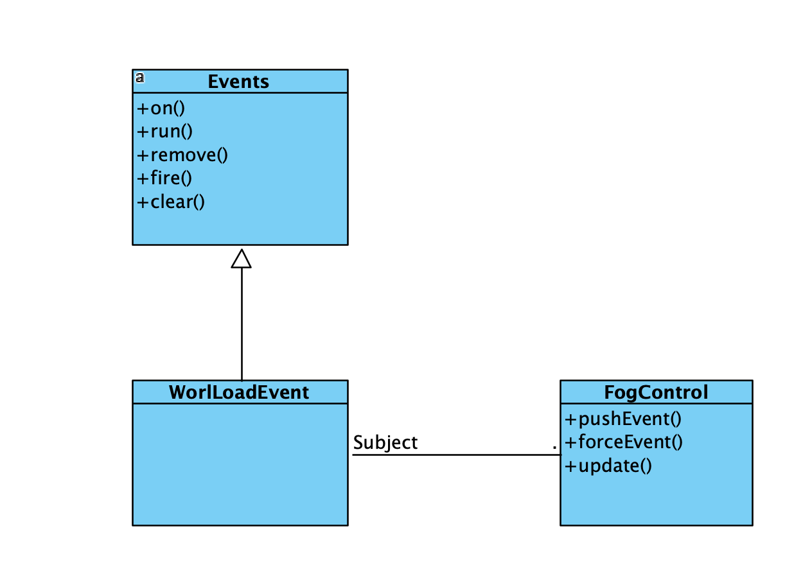

## Observer Pattern 

`External Libraries...arc-core-8d3f84b3c5\arc\Events`
### Code Snippet

```Java
package arc;


import arc.struct.Seq;
import arc.struct.ObjectMap;
import arc.func.Cons;

/** Simple global event listener system. */
@SuppressWarnings("unchecked")
public class Events{
    private static final ObjectMap<Object, Seq<Cons<?>>> events = new ObjectMap<>();

    /** Handle an event by class. */
    public static <T> void on(Class<T> type, Cons<T> listener){
        events.get(type, () -> new Seq<>(Cons.class)).add(listener);
    }

    /** Handle an event by enum trigger. */
    public static void run(Object type, Runnable listener){
        events.get(type, () -> new Seq<>(Cons.class)).add(e -> listener.run());
    }

    /** Only use this method if you have the reference to the exact listener object that was used. */
    public static <T> boolean remove(Class<T> type, Cons<T> listener){
        return events.get(type, () -> new Seq<>(Cons.class)).remove(listener);
    }

    /** Fires an enum trigger. */
    public static <T extends Enum<T>> void fire(Enum<T> type){
        Seq<Cons<?>> listeners = events.get(type);

        if(listeners != null){
            int len = listeners.size;
            Cons[] items = listeners.items;
            for(int i = 0; i < len; i++){
                items[i].get(type);
            }
        }
    }

    /** Fires a non-enum event by class. */
    public static <T> void fire(T type){
        fire(type.getClass(), type);
    }

    public static <T> void fire(Class<?> ctype, T type){
        Seq<Cons<?>> listeners = events.get(ctype);

        if(listeners != null){
            int len = listeners.size;
            Cons[] items = listeners.items;
            for(int i = 0; i < len; i++){
                items[i].get(type);
            }
        }
    }

    /** Don't do this. */
    public static void clear(){
        events.clear();
    }
}
```

`...\src\mindustry\game\FogControl`

### Code Snippet

```Java
    public void update(){
        (...)
    }
    
    (...)
    void stop(){
        lastEntityUpdateIndex = 0;
        fog = null;
        //I don't care whether the fog thread crashes here, it's about to die anyway
        staticEvents.clear();
        if(staticFogThread != null){
            staticFogThread.interrupt();
            staticFogThread = null;
        }

        dynamicEvents.clear();
        if(dynamicFogThread != null){
            dynamicFogThread.interrupt();
            dynamicFogThread = null;
        }
    }
    (...)
    void pushEvent(long event, boolean skipRender){
        if(!state.rules.staticFog) return;

        staticEvents.add(event);
        if(!skipRender && !headless && FogEvent.team(event) == Vars.player.team().id){
            renderer.fog.handleEvent(event);
        }
    }

(...)

```
### Class Diagram


### Rationale

The Observer Pattern is used in Mindustry to let different parts of the game react automatically to events without being directly connected to each other.
In this case:

- The class `arc.Events` works as the **Subject**, keeping a list of all event listeners.
- When an event happens, the `fire()` method notifies every listener that subscribed to that type of event.
- Classes like `FogControl` act as **Observers**, registering to events such as `WorldLoadEvent`, `TileChangeEvent`, `ResetEvent`, or `UnitDestroyEvent.
- This system makes the code modular and flexible, since new features can be added just by subscribing to events, without changing existing logic.

**Benefits**
- Less Coupling
- Easy to extend
- Reactive behavior
