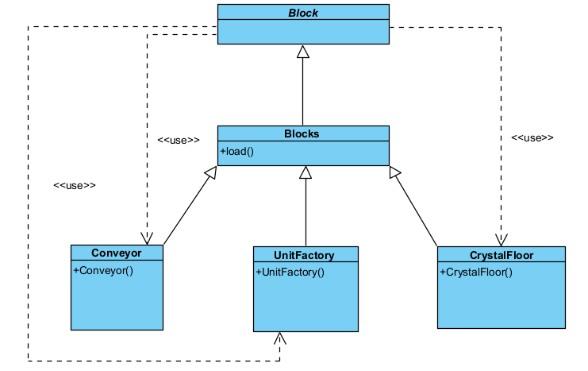

# Factory Method

`...\core\src\mindustry\content\Blocks`

### Code Snippet
```java
public class Blocks {
    public static Block

            //environment
            air, spawn, removeWall, removeOre, cliff, deepwater, water, taintedWater, deepTaintedWater, tar, slag, cryofluid, stone, craters, charr, sand, darksand, dirt, mud, ice, snow, darksandTaintedWater, space, empty,
            dacite, rhyolite, rhyoliteCrater, roughRhyolite, regolith, yellowStone, redIce, redStone, denseRedStone,
            arkyciteFloor, arkyicStone,
            redmat, bluemat,
            stoneWall, dirtWall, sporeWall, iceWall, daciteWall, sporePine, snowPine, pine, shrubs, whiteTree, whiteTreeDead, sporeCluster,
            redweed, purbush, yellowCoral,
            rhyoliteVent, carbonVent, arkyicVent, yellowStoneVent, redStoneVent, crystallineVent, stoneVent, basaltVent,
            regolithWall, yellowStoneWall, rhyoliteWall, carbonWall, redIceWall, ferricStoneWall, beryllicStoneWall, arkyicWall, crystallineStoneWall, redStoneWall, redDiamondWall,
            ferricStone, ferricCraters, carbonStone, beryllicStone, crystallineStone, crystalFloor, yellowStonePlates,
            iceSnow, sandWater, darksandWater, duneWall, sandWall, moss, sporeMoss, shale, shaleWall, grass, salt,
            coreZone,
    //boulders
    shaleBoulder, sandBoulder, daciteBoulder, boulder, snowBoulder, basaltBoulder, carbonBoulder, ferricBoulder, beryllicBoulder, yellowStoneBoulder,
            arkyicBoulder, crystalCluster, vibrantCrystalCluster, crystalBlocks, crystalOrbs, crystallineBoulder, redIceBoulder, rhyoliteBoulder, redStoneBoulder,

    metalFloor, metalFloorDamaged, metalFloor2, metalFloor3, metalFloor4, metalFloor5, basalt, magmarock, hotrock, snowWall, saltWall,
    //old metal floors
    darkPanel1, darkPanel2, darkPanel3, darkPanel4, darkPanel5, darkPanel6, darkMetal,
    //new metal floors
    metalTiles1, metalTiles2, metalTiles3, metalTiles4, metalTiles5, metalTiles6, metalTiles7, metalTiles8, metalTiles9, metalTiles10, metalTiles11, metalTiles12, metalTiles13,
    //new metal walls
    metalWall1, metalWall2, metalWall3, metalWall4,

    //colored
    coloredFloor, coloredWall,
            characterOverlayGray,
            characterOverlayWhite,
            runeOverlay,
            cruxRuneOverlay,

    pebbles, tendrils,

    //ores
    oreCopper, oreLead, oreScrap, oreCoal, oreTitanium, oreThorium,
            oreBeryllium, oreTungsten, oreCrystalThorium, wallOreThorium,

    //wall ores
    wallOreBeryllium, graphiticWall, wallOreTungsten,

    //crafting
    siliconSmelter, siliconCrucible, kiln, graphitePress, plastaniumCompressor, multiPress, phaseWeaver, surgeSmelter, pyratiteMixer, blastMixer, cryofluidMixer,
            melter, separator, disassembler, sporePress, pulverizer, incinerator, coalCentrifuge,

    //crafting - erekir
    siliconArcFurnace, electrolyzer, oxidationChamber, atmosphericConcentrator, electricHeater, slagHeater, phaseHeater, heatRedirector, smallHeatRedirector, heatRouter, slagIncinerator,
            carbideCrucible, slagCentrifuge, surgeCrucible, cyanogenSynthesizer, phaseSynthesizer, heatReactor,

    //sandbox
    powerSource, powerVoid, itemSource, itemVoid, liquidSource, liquidVoid, payloadSource, payloadVoid, illuminator, heatSource,

    //defense
    copperWall, copperWallLarge, titaniumWall, titaniumWallLarge, plastaniumWall, plastaniumWallLarge, thoriumWall, thoriumWallLarge, door, doorLarge,
            phaseWall, phaseWallLarge, surgeWall, surgeWallLarge,

    //walls - erekir
    berylliumWall, berylliumWallLarge, tungstenWall, tungstenWallLarge, blastDoor, reinforcedSurgeWall, reinforcedSurgeWallLarge, carbideWall, carbideWallLarge,
            shieldedWall,

    mender, mendProjector, overdriveProjector, overdriveDome, forceProjector, shockMine,
            scrapWall, scrapWallLarge, scrapWallHuge, scrapWallGigantic, thruster, //ok, these names are getting ridiculous, but at least I don't have humongous walls yet

    //defense - erekir
    radar,
            buildTower,
            regenProjector, barrierProjector, shockwaveTower,
    //campaign only
    shieldProjector,
            largeShieldProjector,
            shieldBreaker,

    //transport
    conveyor, titaniumConveyor, plastaniumConveyor, armoredConveyor, distributor, junction, itemBridge, phaseConveyor, sorter, invertedSorter, router,
            overflowGate, underflowGate, massDriver,

    //transport - alternate
    duct, armoredDuct, ductRouter, overflowDuct, underflowDuct, ductBridge, ductUnloader,
            surgeConveyor, surgeRouter,

    unitCargoLoader, unitCargoUnloadPoint,

    //liquid
    mechanicalPump, rotaryPump, impulsePump, conduit, pulseConduit, platedConduit, liquidRouter, liquidContainer, liquidTank, liquidJunction, bridgeConduit, phaseConduit,

    //liquid - reinforced
    reinforcedPump, reinforcedConduit, reinforcedLiquidJunction, reinforcedBridgeConduit, reinforcedLiquidRouter, reinforcedLiquidContainer, reinforcedLiquidTank,

    //power
    combustionGenerator, thermalGenerator, steamGenerator, differentialGenerator, rtgGenerator, solarPanel, largeSolarPanel, thoriumReactor,
            impactReactor, battery, batteryLarge, powerNode, powerNodeLarge, surgeTower, diode,

    //power - erekir
    turbineCondenser, ventCondenser, chemicalCombustionChamber, pyrolysisGenerator, fluxReactor, neoplasiaReactor,
            beamNode, beamTower, beamLink,

    //production
    mechanicalDrill, pneumaticDrill, laserDrill, blastDrill, waterExtractor, oilExtractor, cultivator,
            cliffCrusher, largeCliffCrusher, plasmaBore, largePlasmaBore, impactDrill, eruptionDrill,

    //storage
    coreShard, coreFoundation, coreNucleus, vault, container, unloader,
    //storage - erekir
    coreBastion, coreCitadel, coreAcropolis, reinforcedContainer, reinforcedVault,

    //turrets
    duo, scatter, scorch, hail, arc, wave, lancer, swarmer, salvo, fuse, ripple, cyclone, foreshadow, spectre, meltdown, segment, parallax, tsunami,

    //turrets - erekir
    breach, diffuse, sublimate, titan, disperse, afflict, lustre, scathe, smite, malign,

    //units
    groundFactory, airFactory, navalFactory,
            additiveReconstructor, multiplicativeReconstructor, exponentialReconstructor, tetrativeReconstructor,
            repairPoint, repairTurret,

    //units - erekir
    tankFabricator, shipFabricator, mechFabricator,

    tankRefabricator, shipRefabricator, mechRefabricator,
            primeRefabricator,

    tankAssembler, shipAssembler, mechAssembler,
            basicAssemblerModule,

    unitRepairTower,

    //payloads
    payloadConveyor, payloadRouter, reinforcedPayloadConveyor, reinforcedPayloadRouter, payloadMassDriver, largePayloadMassDriver, smallDeconstructor, deconstructor, constructor, largeConstructor, payloadLoader, payloadUnloader,

    //logic
    message, switchBlock, microProcessor, logicProcessor, hyperProcessor, largeLogicDisplay, logicDisplay, logicDisplayTile, memoryCell, memoryBank,
            canvas, reinforcedMessage,
            worldProcessor, worldCell, worldMessage, worldSwitch,

    //campaign
    launchPad, advancedLaunchPad, landingPad,
            interplanetaryAccelerator;


    public static void load() {
        //region environment

        air = new AirBlock("air");

        spawn = new SpawnBlock("spawn");

        removeWall = new RemoveWall("remove-wall");

        removeOre = new RemoveOre("remove-ore");

        cliff = new Cliff("cliff") {{
            inEditor = false;
            saveData = true;
        }};

        //Registers build blocks
        //no reference is needed here since they can be looked up by name later
        for (int i = 1; i <= Vars.maxBlockSize; i++) {
            new ConstructBlock(i);
        }

        deepwater = new Floor("deep-water") {{
            speedMultiplier = 0.2f;
            variants = 0;
            liquidDrop = Liquids.water;
            liquidMultiplier = 1.5f;
            isLiquid = true;
            status = StatusEffects.wet;
            statusDuration = 120f;
            drownTime = 200f;
            cacheLayer = CacheLayer.water;
            albedo = 0.9f;
            supportsOverlay = true;
        }};

        water = new Floor("shallow-water") {{
            speedMultiplier = 0.5f;
            variants = 0;
            status = StatusEffects.wet;
            statusDuration = 90f;
            liquidDrop = Liquids.water;
            isLiquid = true;
            cacheLayer = CacheLayer.water;
            albedo = 0.9f;
            supportsOverlay = true;
        }};

        taintedWater = new Floor("tainted-water") {{
            speedMultiplier = 0.5f;
            variants = 0;
            status = StatusEffects.wet;
            statusDuration = 90f;
            liquidDrop = Liquids.water;
            isLiquid = true;
            cacheLayer = CacheLayer.water;
            albedo = 0.9f;
            attributes.set(Attribute.spores, 0.15f);
            supportsOverlay = true;
        }};

        deepTaintedWater = new Floor("deep-tainted-water") {{
            speedMultiplier = 0.18f;
            variants = 0;
            status = StatusEffects.wet;
            statusDuration = 140f;
            drownTime = 200f;
            liquidDrop = Liquids.water;
            liquidMultiplier = 1.5f;
            isLiquid = true;
            cacheLayer = CacheLayer.water;
            albedo = 0.9f;
            attributes.set(Attribute.spores, 0.15f);
            supportsOverlay = true;
        }};

        darksandTaintedWater = new ShallowLiquid("darksand-tainted-water") {{
            speedMultiplier = 0.75f;
            statusDuration = 60f;
            albedo = 0.9f;
            attributes.set(Attribute.spores, 0.1f);
            supportsOverlay = true;
        }};

        sandWater = new ShallowLiquid("sand-water") {{
            speedMultiplier = 0.8f;
            statusDuration = 50f;
            albedo = 0.9f;
            supportsOverlay = true;
        }};

        darksandWater = new ShallowLiquid("darksand-water") {{
            speedMultiplier = 0.8f;
            statusDuration = 50f;
            albedo = 0.9f;
            supportsOverlay = true;
        }};

        tar = new Floor("tar") {{
            drownTime = 230f;
            status = StatusEffects.tarred;
            statusDuration = 240f;
            speedMultiplier = 0.19f;
            variants = 0;
            liquidDrop = Liquids.oil;
            isLiquid = true;
            cacheLayer = CacheLayer.tar;
        }};

        cryofluid = new Floor("pooled-cryofluid") {{
            supportsOverlay = true;
            overlayAlpha = 0.35f;
            drownTime = 150f;
            status = StatusEffects.freezing;
            statusDuration = 240f;
            speedMultiplier = 0.5f;
            variants = 0;
            liquidDrop = Liquids.cryofluid;
            liquidMultiplier = 0.5f;
            isLiquid = true;
            cacheLayer = CacheLayer.cryofluid;

            emitLight = true;
            lightRadius = 25f;
            lightColor = Color.cyan.cpy().a(0.19f);
        }};

        slag = new Floor("molten-slag") {{
            drownTime = 230f;
            status = StatusEffects.melting;
            statusDuration = 240f;
            speedMultiplier = 0.19f;
            variants = 0;
            liquidDrop = Liquids.slag;
            isLiquid = true;
            cacheLayer = CacheLayer.slag;
            attributes.set(Attribute.heat, 0.85f);

            emitLight = true;
            lightRadius = 40f;
            lightColor = Color.orange.cpy().a(0.38f);
        }};

        space = new Floor("space") {{
            cacheLayer = CacheLayer.space;
            placeableOn = false;
            solid = true;
            variants = 0;
            canShadow = false;
            drawEdgeOut = false;
        }};

        empty = new EmptyFloor("empty");

        stone = new Floor("stone");

        craters = new Floor("crater-stone") {{
            variants = 3;
            blendGroup = stone;
        }};

        charr = new Floor("char") {{
            blendGroup = stone;
            attributes.set(Attribute.water, -0.25f);
        }};

        basalt = new Floor("basalt") {{
            attributes.set(Attribute.water, -0.25f);
        }};

        hotrock = new Floor("hotrock") {{
            attributes.set(Attribute.heat, 0.5f);
            attributes.set(Attribute.water, -0.5f);
            blendGroup = basalt;

            emitLight = true;
            lightRadius = 30f;
            lightColor = Color.orange.cpy().a(0.15f);
        }};

        magmarock = new Floor("magmarock") {{
            attributes.set(Attribute.heat, 0.75f);
            attributes.set(Attribute.water, -0.75f);
            blendGroup = basalt;

            emitLight = true;
            lightRadius = 50f;
            lightColor = Color.orange.cpy().a(0.3f);
        }};

        sand = new Floor("sand-floor") {{
            itemDrop = Items.sand;
            playerUnmineable = true;
            attributes.set(Attribute.oil, 0.7f);
        }};
    }
    
    (...)
}
```

### Class Diagram


### Rationale
In *Mindustry*, the `Blocks` class demonstrates the Factory Method Pattern through its `load()` method.
This single method is responsible for instantiating and configuring all block objects used in the game, such as `Conveyor`, `UnitFactory`, etc.
Each of these block types inherits from the abstract `Block` class, which defines the common structure and behavior shared by all blocks.

By centralizing the creation process inside `Blocks.load()`, the pattern encapsulates object instantiation, promotes code organization, and simplifies the addition of new block types.
Developers can extend the system easily by introducing new subclasses of `Block` without modifying existing code, maintaining flexibility and scalability in the game’s content system.