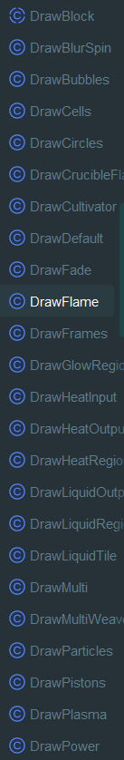
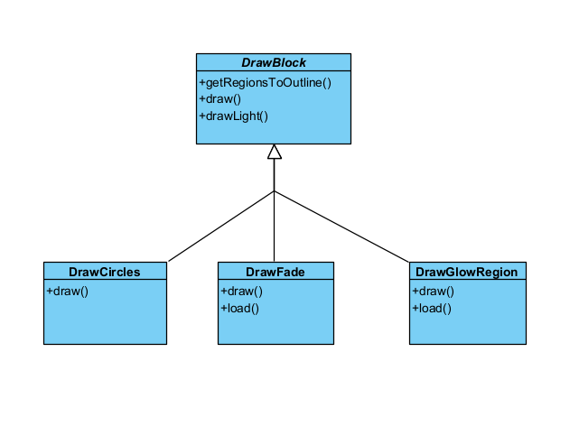

## Observer Pattern 

`...\core\src\mindustry\world\draw\DrawBlock.java`
### Code Snippet

```Java
package mindustry.world.draw;

import arc.*;
import arc.graphics.g2d.*;
import arc.math.*;
import arc.struct.*;
import arc.util.*;
import mindustry.entities.units.*;
import mindustry.gen.*;
import mindustry.world.*;
import mindustry.world.blocks.production.*;

/** An implementation of custom rendering behavior for a crafter block.
 * This is used mostly for mods. */
public abstract class DrawBlock{
    protected static final Rand rand = new Rand();

    /** If set, the icon is overridden to be these strings, in order. Each string is a suffix. */
    public @Nullable String[] iconOverride = null;

    public void getRegionsToOutline(Block block, Seq<TextureRegion> out){

    }

    /** Draws the block itself. */
    public void draw(Building build){

    }

    /** Draws any extra light for the block. */
    public void drawLight(Building build){

    }

    /** Draws the planned version of this block. */
    public void drawPlan(Block block, BuildPlan plan, Eachable<BuildPlan> list){

    }

    /** Load any relevant texture regions. */
    public void load(Block block){

    }

    /** @return the generated icons to be used for this block. */
    public TextureRegion[] icons(Block block){
        return new TextureRegion[]{};
    }

    public final TextureRegion[] finalIcons(Block block){
        if(iconOverride != null){
            var out = new TextureRegion[iconOverride.length];
            for(int i = 0; i < out.length; i++){
                out[i] = Core.atlas.find(block.name + iconOverride[i]);
            }
            return out;
        }
        TextureRegion[] icons = icons(block);
        return icons.length == 0 ? new TextureRegion[]{Core.atlas.find("error")} : icons;
    }

    public GenericCrafter expectCrafter(Block block){
        if(!(block instanceof GenericCrafter crafter)) throw new ClassCastException("This drawer requires the block to be a GenericCrafter. Use a different drawer.");
        return crafter;
    }
}

```

`...\core\src\mindustry\world\draw\DrawFade.java`
### Code snippet
```Java
package mindustry.world.draw;

import arc.*;
import arc.graphics.g2d.*;
import arc.math.*;
import mindustry.gen.*;
import mindustry.world.*;

public class DrawFade extends DrawBlock{
    public String suffix = "-top";
    public float alpha = 0.6f, scale = 3f;
    public TextureRegion region;

    @Override
    public void draw(Building build){
        Draw.alpha(Mathf.absin(build.totalProgress(), scale, alpha) * build.warmup());
        Draw.rect(region, build.x, build.y);
        Draw.reset();
    }

    @Override
    public void load(Block block){
        region = Core.atlas.find(block.name + suffix);
    }
}

```

### All classes with the template




 
### Class Diagram

##### example with only 3 classes but there are more of them

### Rationale

- The Template Method pattern is used here to define a base structure for block drawing.
- The abstract DrawBlock class defines the algorithm's "skeleton" (e.g., in the finalIcons() method) and the steps that can be customized (like draw(), load(), icons()).
- Concrete Classes (e.g., DrawGlowRegion, DrawCircles) extend DrawBlock and implement only the specific steps they need.
- This allows for creating new visual behaviors (especially for mods) without changing the main structure of the drawing algorithm.

