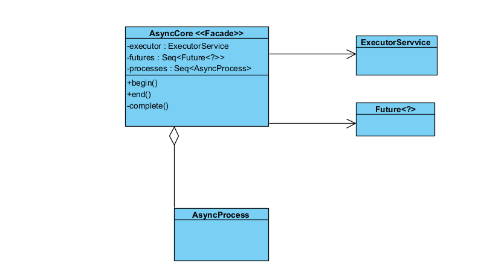

## Facade Pattern
### Code Snippet
`mindustry/async/AsyncCore.java`
```java
package mindustry.async;

import (...);

public class AsyncCore{
    //all processes to be executed each frame
    public final Seq<AsyncProcess> processes = Seq.with(
            new PhysicsProcess(),
            avoidance = new AvoidanceProcess()
    );

    //futures to be awaited
    private final Seq<Future<?>> futures = new Seq<>();

    private ExecutorService executor;

    public AsyncCore(){
        Events.on(WorldLoadEvent.class, e -> {
            complete();
            for(AsyncProcess p : processes){
                p.init();
            }
        });

        Events.on(ResetEvent.class, e -> {
            complete();
            for(AsyncProcess p : processes){
                p.reset();
            }
        });
    }

    public void begin(){
        if(state.isPlaying()){
            //sync begin
            for(AsyncProcess p : processes){
                p.begin();
            }

            futures.clear();

            //init executor with size of potentially-modified process list
            if(executor == null){
                executor = Executors.newFixedThreadPool(processes.size, r -> {
                    Thread thread = new Thread(r, "AsyncLogic-Thread");
                    thread.setDaemon(true);
                    thread.setUncaughtExceptionHandler((t, e) -> Threads.throwAppException(e));
                    return thread;
                });
            }

            //submit all tasks
            for(AsyncProcess p : processes){
                if(p.shouldProcess()){
                    futures.add(executor.submit(p::process));
                }
            }
        }
    }

    public void end(){
        if(state.isPlaying()){
            complete();

            //sync end (flush data)
            for(AsyncProcess p : processes){
                p.end();
            }
        }
    }

    private void complete(){
        (...)
    }
}
```

### Class Diagram


### Rationale
This is a Facade Pattern because the main purpose of the AsyncCore Class is to abstract and simplify the interaction with a complex subsystem, the java.util.concurrent package.
- **Complex Subsystem**: To execute the tasks in parallel and synchronize them back with the main thread, a programmer would need to manually manage several classes and concepts: ExecutorService, Future<?>, Synchronization and Exception Management; 
- **Interface**: AsyncCore hide all of that logic. It exposes just two methods for the app: begin and end, the client just tell (the facade) when the work begins and when it ends.

**Benefits:**
- Reduced Complexity;
- Decoupling;
- Improve Maintainability;