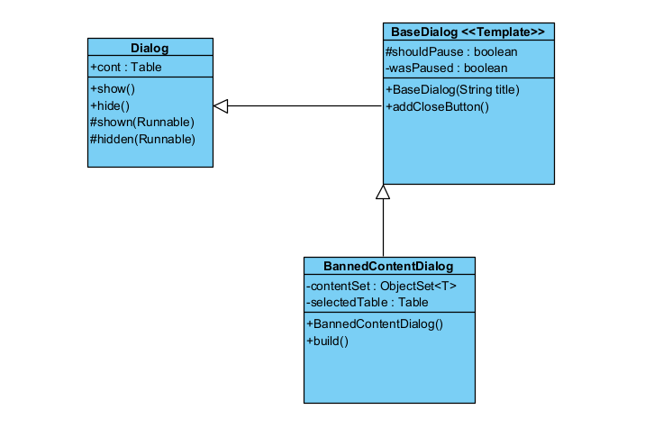

## Template Method Pattern
### Code Snippet 1
`mindustry/ui/dialogs/BaseDialog.java`
```java
package mindustry.ui.dialogs;

import (...);

public class BaseDialog extends Dialog{
    protected boolean wasPaused;
    /** If true, this dialog will pause the game while open. */
    protected boolean shouldPause;

    public BaseDialog(String title, DialogStyle style){
        super(title, style);
        setFillParent(true);
        this.title.setAlignment(Align.center);
        titleTable.row();
        titleTable.image(Tex.whiteui, Pal.accent).growX().height(3f).pad(4f);

        hidden(() -> {
            if(shouldPause && state.isGame() && !net.active() && !wasPaused){
                state.set(State.playing);
            }
            Sounds.back.play();
        });

        shown(() -> {
            if(shouldPause && state.isGame() && !net.active()){
                wasPaused = state.is(State.paused);
                state.set(State.paused);
            }
        });
    }
    (...)

    @Override
    public void addCloseButton(){
        addCloseButton(210f);
    }
}
```

### Code Snippet 2
`mindustry/editor/BannedContentDialog.java`
```java
package mindustry.editor;

import (...);

public class BannedContentDialog<T extends UnlockableContent> extends BaseDialog{
    (...)

    public BannedContentDialog(String title, ContentType type, Boolf<T> pred){
        super(title);
        this.type = type;
        this.pred = pred;
        contentSearch = "";

        selectedTable = new Table();
        deselectedTable = new Table();

        addCloseButton();

        shown(this::build);
        resized(this::build);
    }

    public void show(ObjectSet<T> contentSet){
        this.contentSet = contentSet;
        show();
    }

    public void build(){
        cont.clear();

        var cell = cont.table(t -> {
            t.table(s -> {
                s.label(() -> "@search").padRight(10);
                var field = s.field(contentSearch, value -> {
                    contentSearch = value.trim().replaceAll(" +", " ").toLowerCase();
                    rebuildTables();
                }).get();
                s.button(Icon.cancel, Styles.emptyi, () -> {
                    contentSearch = "";
                    field.setText("");
                    rebuildTables();
                }).padLeft(10f).size(35f);
            });
            if(type == ContentType.block){
                t.row();
                t.table(c -> {
                    c.marginTop(8f);
                    c.defaults().marginRight(4f);
                    for(Category category : Category.values()){
                        c.button(ui.getIcon(category.name()), Styles.squareTogglei, () -> {
                            if(selectedCategory == category){
                                selectedCategory = null;
                            }else{
                                selectedCategory = category;
                            }
                            rebuildTables();
                        }).size(45f).update(i -> i.setChecked(selectedCategory == category)).padLeft(4f);
                    }
                    c.add("").padRight(4f);
                }).center();
            }
        });
        cont.row();
        (...)
    }

    (...)
}
```

### Class Diagram

### Rationale
This class is an instance of Template Method because `BaseDialog` class defines a skeleton for the behavior and appearance of all dialogs in game, deferring the implementation of specific content to its subclasses.
- **1. The Template Method:** the algorithm here is the lifecycle of a dialog. This skeleton is defined in `BaseDialog` and includes invariant steps:
    - **Visual Structure** (`titleTable.image(...)`);
    - **Fix Behaviour** (pause/resume logic);
    - **Common Functionality** (the `addCloseButton()`);
- **2.** The skeleton just defines how the dialog works, but not what it shows. The deferred step is the filling of the content. The `BaseDialog` exposes the `Table` (inherited from the Dialog class `arc.scene.ui.Dialog`) called `cont`, as a blank space.
- **3.** Classes like `BannedContentDialog` inherit from `BaseDialog` and fill the blank space. They do this by implementing their own logic (ex. `build()`) that add extras to the `cont` table.

**Benefits:**
- Code Reusability;
- UI Consistency;
- Simplified Implementations;