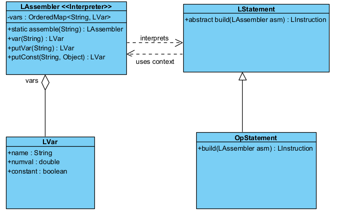

## Interpreter Pattern
### Code Snippet 1
`mindustry/logic/LAssembler.java`
```java
package mindustry.logic;

import (...);

/** "Compiles" a sequence of statements into instructions. */
public class LAssembler{
    (...)
    /** Maps names to variable. */
    public OrderedMap<String, LVar> vars = new OrderedMap<>();
    /** All instructions to be executed. */
    public LInstruction[] instructions;

    (...)

    public static LAssembler assemble(String data, boolean privileged){
        LAssembler asm = new LAssembler();

        Seq<LStatement> st = read(data, privileged);

        asm.privileged = privileged;

        asm.instructions = st.map(l -> l.build(asm)).retainAll(l -> l != null).toArray(LInstruction.class);
        return asm;
    }

    public static String write(Seq<LStatement> statements){
        StringBuilder out = new StringBuilder();
        for(LStatement s : statements){
            s.write(out);
            out.append("\n");
        }

        return out.toString();
    }

    (...)

    /** @return a variable by name.
     * This may be a constant variable referring to a number or object. */
    public LVar var(String symbol){
        LVar constVar = Vars.logicVars.get(symbol, privileged);
        if(constVar != null) return constVar;

        symbol = symbol.trim();

        //string case
        if(!symbol.isEmpty() && symbol.charAt(0) == '\"' && symbol.charAt(symbol.length() - 1) == '\"'){
            return putConst("___" + symbol, symbol.substring(1, symbol.length() - 1).replace("\\n", "\n"));
        }

        //remove spaces for non-strings
        symbol = symbol.replace(' ', '_');

        //use a positive invalid number if number might be negative, else use a negative invalid number
        double value = parseDouble(symbol);

        if(Double.isNaN(value)){
            return putVar(symbol);
        }else{
            if(Double.isInfinite(value)) value = 0.0;
            //this creates a hidden const variable with the specified value
            return putConst("___" + value, value);
        }
    }
    (...)
}
```

### Code Snippet 2
`mindustry/logic/LStatement.java`
```java
package mindustry.logic;

import (...);

/**
 * A statement is an intermediate representation of an instruction, to be used mostly in UI.
 * Contains all relevant variable information. */
public abstract class LStatement{

    private static final String[] aligns = {"topLeft", "top", "topRight", "left", "center", "right", "bottomLeft", "bottom", "bottomRight"};
    public static final ObjectMap<String, Integer> nameToAlign = ObjectMap.of(
    "center", Align.center,
    "top", Align.top,
    "bottom", Align.bottom,
    "left", Align.left,
    "right", Align.right,
    "topLeft", Align.topLeft,
    "topRight", Align.topRight,
    "bottomLeft", Align.bottomLeft,
    "bottomRight", Align.bottomRight
    );
    public static final IntMap<String> alignToName = new IntMap<>();

    static {
        nameToAlign.each((k, v) -> alignToName.put(v, k));
    }

    public transient @Nullable StatementElem elem;

    public abstract void build(Table table);

    public abstract LInstruction build(LAssembler builder);
    
    (...)

}
```
### Class Diagram


### Rationale
This class is an instance of Interpreter design pattern. Its main purpose is analyzing and processing a scripting language (in this case "mlog" of Mindustry).
- **Language and Grammar**: this pattern applies when there is a language to interpret. Here the language is the code mlog written by players.
- **Representation**: the process starts in the method `assemble`, that calls `read()`. This method uses a `LParser` to transform the source text in a `Seq<LStatement>`. This sequence is a representation of language's grammar.
- **Context**: The `LAssembler` acts as the Symbol Table. Its attribute `vars` stores the global state of interpretation: which variables exists, which ones are constants, etc.
- **Interpretation**: The method `var(String symbol)` is a micro interpreter, it takes a text token and decides what it means in the language context. The method `assemble` iterates the `Seq<LStatement>` and calls `l.build(asm)` on each statement. Each declaration uses the `asm` (context) to find its variables and compile itself in a `LInstruction` (the interpretation result).

Benefits:
- **Extensive Grammar**: easy addition of new instructions.
- **Encapsulated Logic**: Each grammar rule (each type of `LStatement`) knows how to interpret itself. 
- **Context Separation**: the pattern clearly separates the interpretation context (`LAssembler` with `vars`) from the language rules (`LStatement` classes).