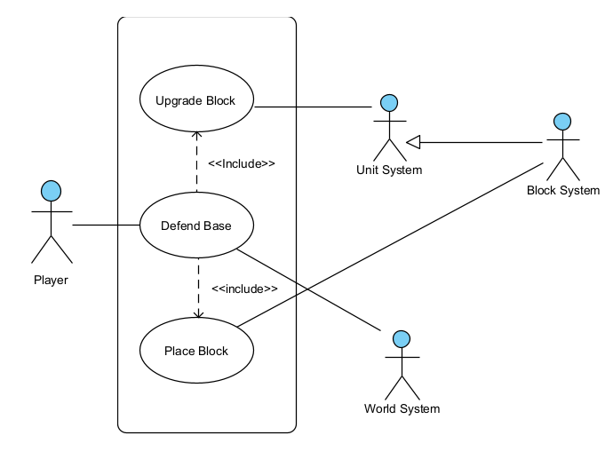

# Use cases

## *Mindustry* – Additional Gameplay Use Cases

This section presents five gameplay use cases that focus on core interactions a player can have with *Mindustry’s* systems. 
Each use case highlights a distinct action or mechanic, from upgrading structures to managing units and automating production. 
These examples demonstrate how players can engage strategically with the game world.

---

### Use Case Name: Upgrade Block
- **Description:** The player upgrades an existing block to a higher tier, improving efficiency or capacity (e.g., faster conveyor, stronger turret).
- **Primary Actor:** Player
- **Secondary Actors:** World System, Block System
- **Related Use Cases:** Place Block, Link Blocks

---

### Use Case Name: Deploy Unit
- **Description:** The player produces or deploys a unit (e.g., drone, soldier) at a valid spawn point to mine,
attack, or transport resources.
- **Primary Actor:** Player
- **Secondary Actors:** Unit System, World System
- **Related Use Cases:** Build Schematic, Command Unit

---

### Use Case Name: Command Unit

- **Description:** The player selects a unit and issues commands such as move, attack, or follow a path.
- **Primary Actor:** Player
- **Secondary Actors:** Unit System
- **Related Use Cases:** Deploy Unit, Build Schematic

---

### Use Case Name: Automate Production

- **Description:** The player sets up automated production chains using conveyors, drills, and processors to
efficiently convert raw resources into advanced materials.
- **Primary Actor:** Player
- **Secondary Actors:** Block System, World System
- **Related Use Cases:** Place Block, Link Blocks

---

### Use Case Name: Defend Base
- **Description:** The player organizes defenses against incoming enemy waves by placing turrets, walls, and 
traps to protect critical structures.
- **Primary Actor:** Player
- **Secondary Actors:** World System, Unit System, Block System
- **Related Use Cases:** Place Block, Upgrade Block

---

## 🧩 **Use Case Summary Table**
| Use Case Name | Description | Primary Actor | Secondary Actors | Related Use Cases             |
|----------------|-------------|----------------|------------------|-------------------------------|
| Upgrade Block | Upgrades a block to a higher tier, improving efficiency or capacity. | Player | World System, Block System | Place Block, Link Blocks      |
| Deploy Unit | Produces or deploys a unit to mine, attack, or transport resources. | Player | Unit System, World System | Build Schematic, Command Unit |
| Command Unit | Selects a unit and issues move, attack, or path commands. | Player | Unit System | Deploy Unit, Build Schematic  |
| Automate Production | Sets up automated production chains to convert raw resources into advanced materials. | Player | Block System, World System | Place Block, Link Blocks      |
| Defend Base |Organizes defenses against enemies using turrets, walls, and traps. | Player | World System, Unit System, Block System | Place Block, Upgrade Block                     |

## Defend Base Diagram
