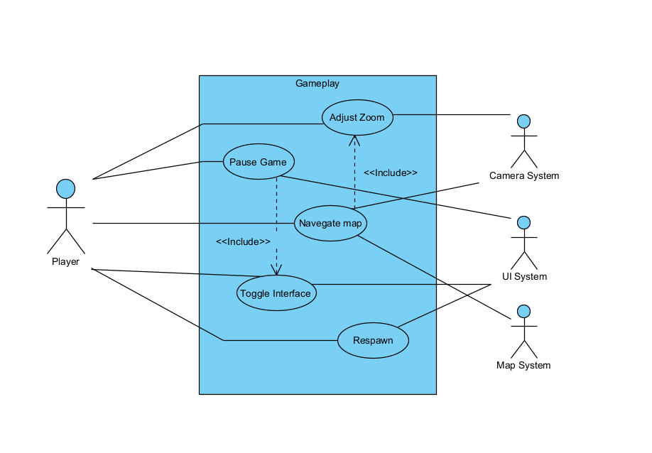

# Use cases

## *Mindustry* – Additional Gameplay Use Cases

This section presents five gameplay use cases that focus on key player interactions with Mindustry’s interface and control systems.
Each use case represents a direct action performed by the player to navigate, manage, or control aspects of the game environment.
These examples illustrate how the player can manipulate the game state, visibility, and perspective during gameplay.

---

### Use Case Name: Adjust Zoom
- **Description**: The player zooms in or out on the map using the mouse wheel or touch gestures to change the camera scale.
- **Primary Actor**: Player
- **Secondary**: Camera System

---

### Use Case Name: Pause Game
- **Description**: The player presses the Spacebar to pause or resume the game, stopping all in-game actions and timers.
- **Primary Actor**: Player
- **Secondary Actors**: UI System

---

### Use Case Name:Navigate Map

- **Description**: The player opens the global map view and selects a specific region to inspect or manage.
- **Primary Actor**: Player
- **Secondary Actors**: Map System, Camera System

---

### Use Case Name: Toggle Interface

- **Description**: The player presses the C key to hide or display the UI elements such as wave bar, minimap, and tools.
- **Primary Actor**: Player
- **Secondary Actors**: UI System

---

### Use Case Name:Respawn
- **Description**: The player presses the V key to respawn near the main core after destruction or when manually triggered.

- **Primary Actor**: Player

- **Secondary Actors**: Unit System

---

## 🧩 **Use Case Summary Table**
| Use Case Name | Description                                             | Primary Actor | Secondary Actors |
|--------------|---------------------------------------------------------|----------------|------------------
| Adjust Zoom | Zooms in or out on the map to change perspective.       | Player | Camera System| 
| Pause Game | Pauses or resumes gameplay, freezing all activity.      | Player | UI System |
| Navigate Map | Opens the map and selects regions to inspect or manage. | Player | Map System, Camera System |                
| Toggle Interface | Shows or hides the UI (wave bar, minimap, tools).       | Player | UI System |                          
| Respawn | Respawns the player next to the core after destruction. | Player | Unit System|

## Use Case Diagram
