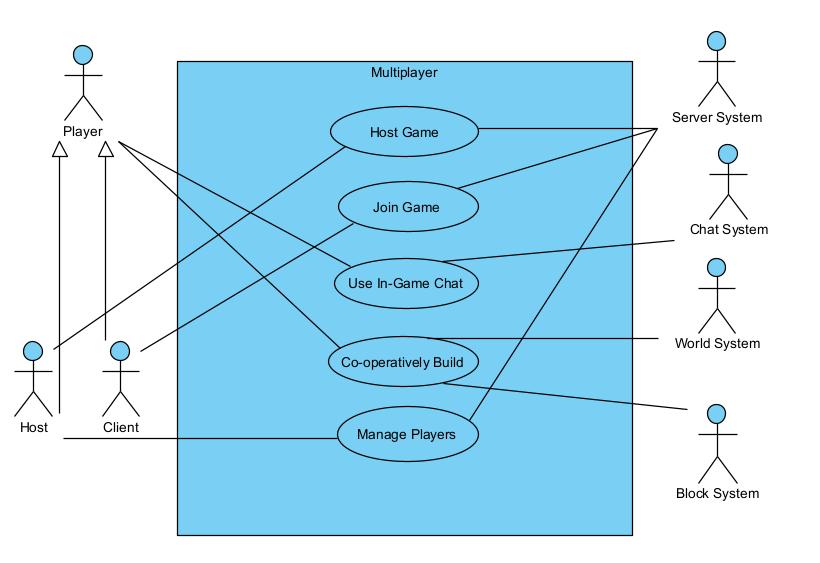

# Use cases

##  Mindustry – Multiplayer Use Case Model

This use case model represents main interactions of multiplayer experience in Mindustry. All use cases are linked as flux part of shared session, cover since hosting or joining a game, until the communication and players management.

---

### **Use Case Name:** Host Game
**Description:** The player starts a new game or load a save game has host, open it to other players which can join it.  

**Primary Actor:** Host Player   

**Secondary Actors:** Client Player, Server System

**Related Use Cases:** Join Game, Manage Players

---

### **Use Case Name:** Join Game
**Description:** The Client player search a game in servers list or insert the IP to join an active session for other player.

**Primary Actor:** Client Player

**Secondary Actors:** Host Player, Server System

**Related Use Cases:** Host Game, Use In-Game Chat, Co-operatively Build

---

### **Use Case Name:** Use In-Game Chat
**Description:** The player write and send a text message that is distributed and visible to other players in the session.

**Primary Actor:** Player 

**Secondary Actors:** Other Players, Chat System

**Related Use Cases:** Join Game

---

### **Use Case Name:** Co-operatively Build
**Description:** The player puts, remove or link blocks in the shared world. Changes are visible for all players and sources are used from a pool from a shared team.

**Primary Actor:** Player

**Secondary Actors:** Players, World System, Block System

**Related Use Cases:** Join Game

---

### **Use Case Name:** Manage Players
**Description:** The Host player visualize the list of players on the session, and can execute administrative actions like kick, ban, or change the client's team.

**Primary Actor:** Host Player  

**Secondary Actors:** Client Player, Server System

**Related Use Cases:** Host Game, Join Game

---

## Use Case Diagram

In case of confusion, here are captions for the Secondary Actors links:
- Server System -> Host Game
- Server System -> Join Game
- Server System -> Manage Players
- Chat System -> Use In-Game Chat
- World System -> Co-operatively Build
- Block System -> Co-operatively Build

**Extra**: To guarantee legibility, we don't put some links of Secondary Actors, so here are the description of them:

- Client -> Host Game
- Host -> Join Game
- Client -> Manage Players

