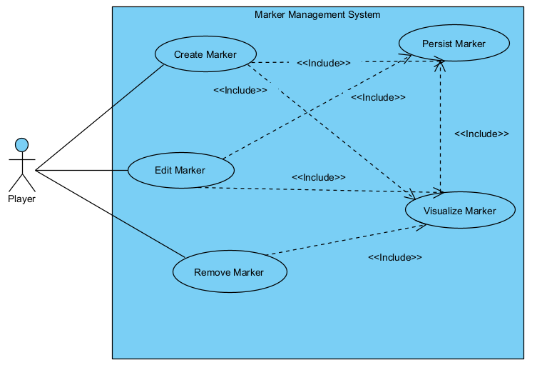

# User story 1
Markers
## Author(s)

- Leandro Rodrigues (68211)
- Luís Muacho (68301)

## Reviewer(s)
(*Please add the user story reviewer(s) here, one in each line, providing the authors' name and surname, along with their student number. In the reviews presented in this document, add the corresponding reviewers.*)
## User Story:
As a player, I want to be able to place customizable markers on the map to identify important areas, so that I can better organize my base and communicate with myself throughout the game.
### Review
*(Please add your user story review here)*
## Use case diagram

## Use case textual description
### UC1 – Create Marker
- **Name**: Create Marker
- **ID**: UC1
- **Description**: The player creates a new marker at their current position.
- **Actors**
    - **Primary**: Player
    - **Secondary**: -

**Preconditions**:

- The player is inside an active map.

- The system is not paused.

**Main Scenario**:

1. The player presses the key assigned to marker creation.

2. The system obtains the player’s current X,Y position.

3. The system creates a new Marker object with initial values (position, default color, empty text, unique ID).

4. The system adds the marker to the map’s marker list.

5. The system automatically opens the editing window (see UC2).

**Alternative Scenarios**:
None.

**Postconditions**:

- A new marker exists on the map.

### UC2 – Edit Marker
- **Name**: Edit Marker
- **ID**: UC2
- **Description**: The player modifies the text and/or color of an existing marker.
- **Actors**
    - **Primary**: Player
    - **Secondary**: -

**Preconditions**:

- The marker already exists.
- The player clicked on a marker OR has just created one.

**Main Scenario**:

1. The system displays the editing popup.

2. The player types a text (max 15-20 characters).

3. The player selects a color from the available options.

4. The player presses “Confirm.”

5. The system updates the marker with the new properties.

**Alternative Scenarios**:
- A1 - Text exceeds character limit:
The player types more characters than allowed.
The system blocks addtional input.
 
**Postconditions**:

- The marker displays the updated properties.

### UC3 – Remove Marker
- **Name**: Remove Marker
- **ID**: UC3
- **Description**: The player deletes an existing marker.
- **Actors**:
    - **Primary**: Player
    - **Secondary**: —

**Preconditions**:

- The marker exists on the map.

**Main Scenario**:

1. The player opens the editing popup for a marker.

2. The player presses the trash icon.

3. The system removes the marker from the map’s marker list.

4. The marker disappears from the map.

**Alternative Scenarios**:
- None.

**Postconditions**:

- The marker no longer exists on the map.

### UC4 – View Markers
- **Name**: View Markers
- **ID**: UC4
- **Description**: The player views all markers displayed on the map.
- **Actors**:
    - **Primary**: Player
    - **Secondary**: —

**Preconditions**:

- Active or saved markers exist on the map.

**Main Scenario**:

1. The player moves around the map.

2. The system displays the marker icons at their correct positions.

3. If the player hovers the cursor over a marker:

4. The marker’s text appears as a tooltip.

**Alternative Scenarios**:
    
- None.

**Postconditions**:

- The player correctly sees all markers.

### UC5 – Persist Markers
- **Name**: Persist Markers
- **ID**: UC5
- **Description**: The system saves and loads marker data so markers persist between gameplay sessions.
- **Actors**:
    - **Primary**: System (Marker Management System / Game Map)
    - **Secondary**: —

**Preconditions**:

- Markers exist on the map created by the player.

- The system is ready to save the game state.

**Main Scenario**:

1. Whenever a marker is created, edited, or removed, the system saves the change to the save file.

2. When loading a map, the system reads all saved markers.

3. The system recreates the Marker objects on the map with all properties (position, color, text).

**Alternative Scenarios**:

A1 — Save file corrupted or inaccessible:
1. The system detects that the save file is corrupted.
2. The system shows a warning and ignores all saved markers.

**Postconditions**:

- All markers reflect the saved state.

- When reloading the map, markers appear exactly as they were left.

### Review
*(Please add your use case review here)*
## Implementation documentation
(*Please add the class diagram(s) illustrating your code evolution, along with a technical description of the changes made by your team. The description may include code snippets if adequate.*)
### Implementation summary
(*Summary description of the implementation.*)
#### Review
*(Please add your implementation summary review here)*
### Class diagrams
(*Class diagrams and their discussion in natural language.*)
### Review
*(Please add your class diagram review here)*
### Sequence diagrams
(*Sequence diagrams and their discussion in natural language.*)
#### Review
*(Please add your sequence diagram review here)*
## Test specifications
(*Test cases specification and pointers to their implementation, where adequate.*)
### Review
*(Please add your test specification review here)*
