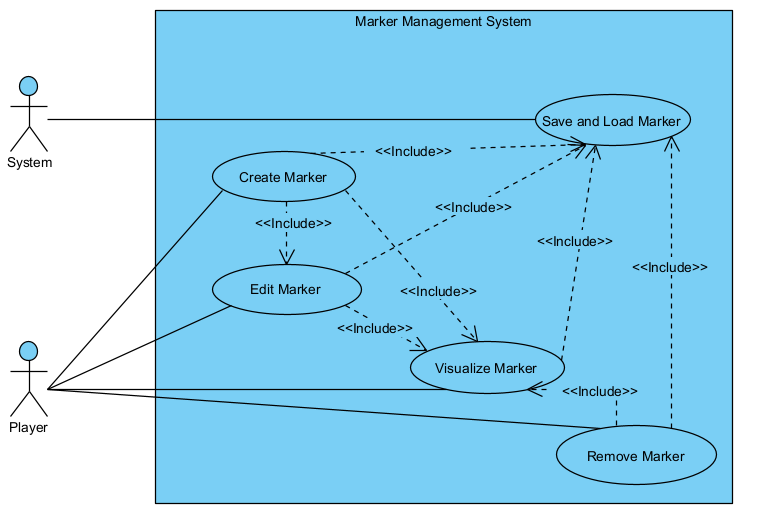
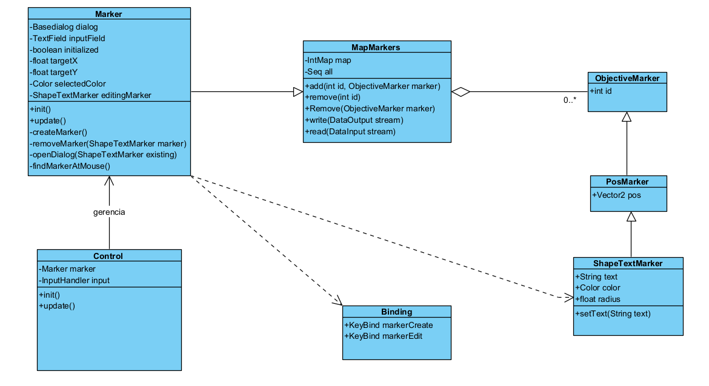
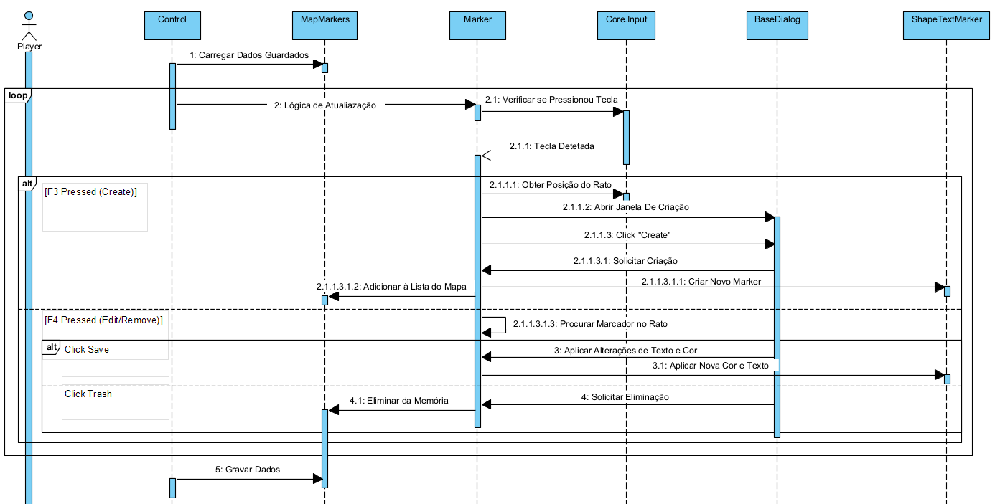

# User story 1
Markers
## Author(s)

- Leandro Rodrigues (68211)
- Luís Muacho (68301)

## Reviewer(s)

- Dinis Raleiras (67819)
- Filipe Nobre (67850)

## User Story:
As a player, I want to be able to place customizable markers on the map to identify important areas, so that I can better organize my base and communicate with myself throughout the game.
### Review
The user story is well structured, gives a clear view of the player’s perspective, and is useful for developing the new feature.
## Use case diagram

## Use case textual description
### UC1 – Create Marker
- **Name**: Create Marker
- **ID**: UC1
- **Description**: The player creates a new marker at their current position.
- **Actors**
    - **Primary**: Player
    - **Secondary**: -

**Preconditions**:

- The player is inside an active map.

- The system is not paused.

**Main Scenario**:

1. The player presses the key assigned to marker creation.

2. The system obtains the player’s current X,Y position.

3. The system creates a new Marker object with initial values (position, default color, empty text, unique ID).

4. The system adds the marker to the map’s marker list.

5. The system automatically opens the editing window (see UC2).

**Alternative Scenarios**:
None.

**Postconditions**:

- A new marker exists on the map.

### UC2 – Edit Marker
- **Name**: Edit Marker
- **ID**: UC2
- **Description**: The player modifies the text and/or color of an existing marker.
- **Actors**
    - **Primary**: Player
    - **Secondary**: -

**Preconditions**:

- The marker already exists.
- The player clicked on a marker OR has just created one.

**Main Scenario**:

1. The system displays the editing popup.

2. The player types a text (max 15-20 characters).

3. The player selects a color from the available options.

4. The player presses “Confirm.”

5. The system updates the marker with the new properties.

**Alternative Scenarios**:
- A1 - Text exceeds character limit:
The player types more characters than allowed.
The system blocks addtional input.
 
**Postconditions**:

- The marker displays the updated properties.

### UC3 – Remove Marker
- **Name**: Remove Marker
- **ID**: UC3
- **Description**: The player deletes an existing marker.
- **Actors**:
    - **Primary**: Player
    - **Secondary**: —

**Preconditions**:

- The marker exists on the map.

**Main Scenario**:

1. The player opens the editing popup for a marker.

2. The player presses the trash icon.

3. The system removes the marker from the map’s marker list.

4. The marker disappears from the map.


**Alternative Scenarios**:
- None.

**Postconditions**:

- The marker no longer exists on the map.

### UC4 – Visualize Markers
- **Name**: Visualize Markers
- **ID**: UC4
- **Description**: The player views all markers displayed on the map.
- **Actors**:
    - **Primary**: Player
    - **Secondary**: —

**Preconditions**:

- Active or saved markers exist on the map.

**Main Scenario**:

1. The player moves around the map.

2. The system displays the marker icons at their correct positions.

3. If the player has the marker in the screen;

4. The marker’s text appears above the marker.

**Alternative Scenarios**:
    
- None.

**Postconditions**:

- The player correctly sees all markers.

### UC5 – Save and Load Markers
- **Name**: Save and Load Markers
- **ID**: UC5
- **Description**: The system saves and loads marker data so markers persist between gameplay sessions.
- **Actors**:
    - **Primary**: System (Marker Management System / Game Map)
    - **Secondary**: —

**Preconditions**:

- Markers exist on the map created by the player.

- The system is ready to save the game state.

**Main Scenario**:

1. Whenever a marker is created, edited, or removed, the system saves the change to the save file.

2. When loading a map, the system reads all saved markers.

3. The system recreates the Marker objects on the map with all properties (position, color, text).

**Alternative Scenarios**:

A1 — Save file corrupted or inaccessible:
1. The system detects that the save file is corrupted.
2. The system shows a warning and ignores all saved markers.


**Postconditions**:

- All markers reflect the saved state.

- When reloading the map, markers appear exactly as they were left.

### Review

Overall the use case is well done, although the System (Marker Management System / Game Map) doesn't appear at the use case diagram as an actor.
the `Persist Markers` doesn't have the best name what can cause a little bit of confusion at the first look, a name like `Save and Load Markers`
would be more appropriate.

## Implementation documentation
## Marker Class

`.../core/src/mindustrrker Classy/ui/Marker`

To implement our new funcionality, the marker system, we created a new class called `Marker`.
This Class extends MapMarkers (conceptually acting as a manager) and acts as the central controller for user interaction, managing the UI dialogs to create, edit, deleting them.

### Code Snippet
```java
package mindustry.ui;

import (...)

public class Marker extends MapMarkers {
private BaseDialog dialog;
private TextField inputField;
private Table colorTable;
private boolean initialized = false;
private float targetX, targetY;
private Color selectedColor = Pal.accent;
private ShapeTextMarker editingMarker = null;

    private final Color[] palette = {
            Color.black, Color.blue, Color.green, Color.orange, Color.pink,
            Color.yellow, Color.white, Color.purple, Color.red, Color.brown,
    };

    public void init() {
        if(initialized) return;
        dialog = new BaseDialog("Marker");
        dialog.cont.add("Nota:").left().padBottom(5f).row();
        inputField = new TextField();
        inputField.setMessageText("Escreve aqui...");
        dialog.cont.add(inputField).size(300f, 40f).row();

        dialog.cont.add("Cor:").left().padTop(10f).padBottom(5f).row();
        colorTable = new Table();
        dialog.cont.add(colorTable).row();

        initialized = true;
    }

    public void update() {
        if (!Vars.state.isGame() || Core.scene.hasKeyboard()) return;
        // CRIAR COM F3
        if (Core.input.keyTap(Binding.markerCreate)) {
            if(!initialized) init();
            targetX = Core.input.mouseWorld().x;
            targetY = Core.input.mouseWorld().y;
            openDialog(null);
        }
        // EDITAR COM F4
        if (Core.input.keyTap(Binding.markerEdit)) {
            ShapeTextMarker hovered = findMarkerAtMouse();
            if (hovered != null) {
                if(!initialized) init();
                openDialog(hovered);
            }
        }
    }
    private void openDialog(ShapeTextMarker existing) {
        editingMarker = existing;
        dialog.buttons.clear();
        dialog.buttons.button("Cancelar", dialog::hide).size(100f, 50f);

        if (existing == null) {
            // CREATE
            dialog.title.setText("Novo Marcador");
            inputField.setText("");
            selectedColor = palette[6]; // Default (ex: Branco)

            dialog.buttons.button("Criar", () -> {
                createMarker();
                dialog.hide();
            }).size(100f, 50f).disabled(b -> inputField.getText().isEmpty());

        } else {
            // EDIT
            dialog.title.setText("Editar Marcador");
            inputField.setText(existing.text);
            selectedColor = existing.color;

            dialog.buttons.button(Icon.trash, Styles.clearNonei, () -> {
                removeMarker(existing);
                dialog.hide();
            }).size(50f).padRight(10f);

            dialog.buttons.button("Salvar", () -> {
                updateExistingMarker();
                dialog.hide();
            }).size(100f, 50f).disabled(b -> inputField.getText().isEmpty());
        }
        rebuildColorTable();
        dialog.show();
        Core.scene.setKeyboardFocus(inputField);
    }

    // Reconstrói os botões de cor para mostrar qual está selecionado
    private void rebuildColorTable() {
        colorTable.clear();
        arc.scene.ui.ButtonGroup<ImageButton> group = new arc.scene.ui.ButtonGroup<>();

        for(Color color : palette){
            ImageButton button = colorTable.button(Tex.whiteui, Styles.clearTogglei, 24f, () -> {
                selectedColor = color;
            }).size(40f).pad(4f).get();

            button.getStyle().imageUpColor = color;
            button.getStyle().imageCheckedColor = color;

            // Marca o botão como "checkado" se for a cor atual
            if(selectedColor.equals(color)){
                button.setChecked(true);
            }
            group.add(button);
        }
    }
    // Procura marcador perto do rato
    private ShapeTextMarker findMarkerAtMouse() {
        float worldX = Core.input.mouseWorld().x;
        float worldY = Core.input.mouseWorld().y;
        float range = 24f;

        for (ObjectiveMarker m : Vars.state.markers) {
            if (m instanceof ShapeTextMarker) {
                ShapeTextMarker sm = (ShapeTextMarker) m;
                if (Mathf.dst(worldX, worldY, sm.pos.x, sm.pos.y) < range) {
                    return sm;
                }
            }
        }
        return null;
    }
    private void createMarker() {
        String texto = inputField.getText();
        if(texto.isEmpty()) return;

        ShapeTextMarker marker = new ShapeTextMarker();
        marker.text = texto;
        marker.pos.set(targetX, targetY);
        marker.color = selectedColor;
        marker.radius = 4f;

        // gerar id aleatorio mas verficar para caso existir gerar outro
        int id;
        do {
            id = Mathf.random(10000, 999999);
        } while (Vars.state.markers.has(id));
        Vars.state.markers.add(id, marker);
    }

    private void updateExistingMarker() {
        if (editingMarker != null) {
            editingMarker.setText(inputField.getText(),true);
            editingMarker.color = selectedColor;
        }
    }

    private void removeMarker(ShapeTextMarker marker) {
        Vars.state.markers.remove(marker);
    }
}
```
#### Methods
- **`init()`**: Initializes the UI components, specifically the BaseDialog used for user input. It sets up the text field and color selection table.
- **`update()`**: It listens for `Binding.markerCreate` (F3) and `Binding.markerEdit` (F4) inputs.
  - Use Case 1, Create Marker: Listen F3 press and captures mouse cordinates.
  - Use Case 2, Edit Marker: Listen F4 press and searches for a marker under the mouse cursor.
- **`openDialog()`**: Configures and displays the dialog. If `existing` is null, it prepares for creation, if not, it prepares for editing and enables the delete option (UC3).
- **`createMarker()`**: Instantiates a new `ShapeTextMarker`, assigns it a unique ID, and adds it to the global state.
  - Use Case 1, Create Marker;
  - Use Case 5, Save and Load: By adding to `Vars.state.markers`, it ensures the marker is part of the game state that gets serialized. 
- **`updateExistingMarker()`**: Modifies properties of an already existing marker.
  - Use Case 2, Edit Marker;
- **`removeMarker(ShapeTextMarker marker)`**: Removes the specific marker from the global list.
  - Use Case 3, Remove Marker;
- **`findMarkerAtMouse()`**: A helper method to iterates through existing markers to find one within a specific radius of the cursor.

### Binding Class
`.../core/src/mindustry/input/Binding.java`

This class was modified to put the new key inputs required to create and edit markers.

### Code Snippet
```java
    markerCreate = KeyBind.add("create_marker", KeyCode.f3), //addcionamos por nos
    markerEdit = KeyBind.add("edit_marker", KeyCode.f4), //addcionamos por nos
```
#### Methods 
- **`markerCreate`/`markerEdit`**: Definitions that map the actions to create and edit markers to physical keys, F3 and F4.
  - Use Cases 1 and 2, Create and Edit Marker;

### MapMarkers Class
`.../core/src/mindustry/game/MapMarkers.java`

We extended the functionality of the existing `MapMarkers` class to support object-based removal, facilitating the logic required by the `Marker` UI class.

### Code Snippet
```java
(...)    
// adicionado por nos para remove atraves do objeto
    public void remove(ObjectiveMarker marker){
        int foundId = -1;
        for(var entry : map.entries()){
            if(entry.value == marker){
                foundId = entry.key;
                break;
            }
        }
        if(foundId != -1){
            remove(foundId);
        }
    }
(...)
    public void write(DataOutput stream) throws IOException{
        JsonIO.writeBytes(map, ObjectiveMarker.class, (DataOutputStream)stream);
    }
    public void read(DataInput stream) throws IOException{
        all.clear();
        map = JsonIO.readBytes(IntMap.class, ObjectiveMarker.class, (DataInputStream)stream);
        for(var entry : map.entries()){
            all.add(entry.value);
            entry.value.arrayIndex = all.size - 1;
        }
    }
(...)
```
#### Methods
- **`remove(ObjectiveMarker marker)`**: Iterates through the internal map to find the ID associated with a specific marker object and calls the ID-based remove method.
- **`write(DataOutput stream)` / `read(DataInput stream)`**: Existing methods responsible for serializing the marker data to the save file.
  - Use Case 5, Save and Load: Ensures persistence across sessions.

### Control Class
`.../core/src/mindustry/core/Control.java`

The `Control` class acts as the main game loop manager. We integrated the `Marker` class here to ensure it is initialized and updated alongside other core game systems.

### Code Snippet
```java
public class Control implements ApplicationListener, Loadable {
    (...)
    public Marker marker; // os nossos markers
    (...)

    public void init() {
        platform.updateRPC();
        marker = new Marker(); // criar markers
        marker.init(); // init markers

        //display UI scale changed dialog
        if (Core.settings.getBool("uiscalechanged", false)) {
            Core.app.post(() -> Core.app.post(() -> {
                BaseDialog dialog = new BaseDialog("@confirm");
                dialog.setFillParent(true);

                float[] countdown = {60 * 11};
                Runnable exit = () -> {
                    Core.settings.put("uiscale", 100);
                    Core.settings.put("uiscalechanged", false);
                    dialog.hide();
                    Core.app.exit();
                };

                dialog.cont.label(() -> {
                    if (countdown[0] <= 0) {
                        exit.run();
                    }
                    return Core.bundle.format("uiscale.reset", (int) ((countdown[0] -= Time.delta) / 60f));
                }).pad(10f).expand().center();

                dialog.buttons.defaults().size(200f, 60f);
                dialog.buttons.button("@uiscale.cancel", exit);

                dialog.buttons.button("@ok", () -> {
                    Core.settings.put("uiscalechanged", false);
                    dialog.hide();
                });

                dialog.show();
            }));
        }
    }

    @Override
    public void update() {
        //this happens on Android and nobody knows why
        if (assets == null) return;

        saves.update();

        //update and load any requested assets
        try {
            assets.update();
        } catch (Exception ignored) {
        }

        input.updateState();

        sound.update();

        if (Core.input.keyTap(Binding.fullscreen)) {
            boolean full = settings.getBool("fullscreen");
            if (full) {
                graphics.setWindowedMode(graphics.getWidth(), graphics.getHeight());
            } else {
                graphics.setFullscreen();
            }
            settings.put("fullscreen", !full);
        }

        if (Float.isNaN(Vars.player.x) || Float.isNaN(Vars.player.y)) {
            player.set(0, 0);
            if (!player.dead()) player.unit().kill();
        }
        if (Float.isNaN(camera.position.x)) camera.position.x = world.unitWidth() / 2f;
        if (Float.isNaN(camera.position.y)) camera.position.y = world.unitHeight() / 2f;

        if (state.isGame()) {
            input.update();

            if (!state.isPaused()) {
                indicators.update();
            }
            if (marker != null) {
                marker.update();
            } // update do markers

            //auto-update rpc every 5 seconds
            if (timer.get(0, 60 * 5)) {
                platform.updateRPC();
            }

            //unlock core items
            var core = state.rules.defaultTeam.core();
            if (!net.client() && core != null && state.isCampaign()) {
                core.items.each((i, a) -> i.unlock());
            }

            if (backgroundPaused && settings.getBool("backgroundpause") && !net.active()) {
                state.set(State.paused);
            }

            //cannot launch while paused
            if (state.isPaused() && renderer.isCutscene()) {
                state.set(State.playing);
            }

            if (!net.client() && Core.input.keyTap(Binding.pause) && !(state.isCampaign() && state.afterGameOver) && !renderer.isCutscene() && !scene.hasDialog() && !scene.hasKeyboard() && !ui.restart.isShown() && (state.is(State.paused) || state.is(State.playing))) {
                state.set(state.isPaused() ? State.playing : State.paused);
            }

            if (state.isCampaign() && state.afterGameOver) {
                state.set(State.paused);
            }

            if (Core.input.keyTap(Binding.menu) && !ui.restart.isShown() && !ui.minimapfrag.shown()) {
                if (ui.chatfrag.shown()) {
                    ui.chatfrag.hide();
                } else if (!ui.paused.isShown() && !scene.hasDialog()) {
                    ui.paused.show();
                    if (!net.active()) {
                        state.set(State.paused);
                    }
                }
            }

            if (!mobile && Core.input.keyTap(Binding.screenshot) && !scene.hasField() && !scene.hasKeyboard()) {
                renderer.takeMapScreenshot();
            }

        } else {
            //this runs in the menu
            if (!state.isPaused()) {
                Time.update();
            }

            if (!scene.hasDialog() && !scene.root.getChildren().isEmpty() && !(scene.root.getChildren().peek() instanceof Dialog) && Core.input.keyTap(KeyCode.back)) {
                platform.hide();
            }
        }
    }
}
```
#### Methods
- **`init()`**: Instantiates the `Marker` class and calls its initialization method.
- **`update()`**: Calls `marker.update()` every frame when the game is in the `State.playing` mode. This ensures input polling F3/F4 is active.
  - Use Cases 1, 2 and 4: Ties the marker logic to the game's execution flow.

### Other Classes Referenced
#### ShapeTextMarker
`mindustry.game.MapObjectives.ShapeTextMarker`
Although the full code for this class was not modified, it is heavily used by our Marker class. It represents the data structure that we use for the marker.
    
- Stores the text, color and position data.
- Use Case 4, Visualize Markers: The engine's rendering system iterates over instances of this class to draw them on the map.
- Use Case 5, Save and Load: The object type being serialized/deserialized in MapMarkers.
### Implementation summary
We implemented a custom Marker system allowing players to annotate the map dynamically. The implementation logic is centralized in the new `Marker` class, which handles UI and input. We integrated this into the engine by modifying `Control.java` to initialize and update the marker logic. 
We added specific keybindings in `Binding.java`.
Data persistencd (UC5) is handled by existing `MapMarkers` architecture, which we slightly modified to support object-based removal (UC3). Visual representation (UC4) relies on the existing `ShapeTextMarker` class, which the engine already knows how to render, meaning no custom rendering code was required in `Marker.java` other than setting the properties. 
#### Review
*(Please add your implementation summary review here)*
### Class diagrams

### Review
*(Please add your class diagram review here)*
### Sequence diagrams

#### Review
*(Please add your sequence diagram review here)*
## Test specifications

`java/testsUS1/MarkerTest.java`

Before the tests we have the method setup to initialize the tests environment. This method initializes `Vars.state` to prevent `NUllPointException`. It also creates a fresh instance of `MapMarkers` for each test to ensure state isolation.

```java
@BeforeEach
    void setUp() {
        // Initialize Global Vars State
        if (Vars.state == null) {
            Vars.state = new GameState();
        }

        // Initialize the container (Using the parent class logic used by Marker)
        markersContainer = new MapMarkers();

        // Inject this container into Vars.state so static references work if needed
        Vars.state.markers = markersContainer;
    }
```

#### Test 1 - Marker Data Verification

This test main objective is to verify that the `ShapeTextMarker` object correctly stores the attributes gived by the user, specifically the text and position.

```java
@Test
    @DisplayName("1. Marker Data: Must store correct attributes (Text/Color/Pos)")
    void testMarkerAttributes() {
        // Test UC1/UC2 Data Structure
        ShapeTextMarker marker = new ShapeTextMarker();
        String expectedText = "Attack Here!";
        Vec2 expectedPos = new Vec2(100f, 200f);

        marker.setText(expectedText, false);
        marker.pos.set(expectedPos);

        assertEquals("Attack Here!", marker.text, "Marker text should match input");
        assertEquals(100f, marker.pos.x, "X position should be 100");
        assertEquals(200f, marker.pos.y, "Y position should be 200");
    }
```
This ensures that the data structure used in Create and Edit (UC1, UC2) operations works as expected.

#### Test 2 - Storage Logic Verification

This test validates the core functionality of `MapMarkers` container, ensuring that markers can be added via unique ID's and retrieved correctly, which is essential for data persistence (UC5).

```java
@Test
    @DisplayName("2. Storage Logic: Add and Retrieve Marker by ID")
    void testAddAndRetrieve() {
        ShapeTextMarker marker = new ShapeTextMarker();
        marker.text = "Base Alpha";
        int uniqueID = 12345;

        // Add to container (Logic used in UC1)
        markersContainer.add(uniqueID, marker);

        assertTrue(markersContainer.has(uniqueID), "Container must contain the ID after adding");
        assertEquals(marker, markersContainer.get(uniqueID), "Retrieved object must match the added object");
        assertEquals(1, markersContainer.size(), "Size must be 1");
    }
```

#### Test 3 - Remove By Object Reference Verification

This test focus on `remove(ObjectiveMarker marker)` that we implemented in `MapMarkers` class. It verifies that the system can identify and remove a marker using the object reference with success, confirming the backend logic required for the delete button (UC3).

```java
@Test
    @DisplayName("3. Remove Logic: Must remove marker by Object Reference (New Implementation)")
    void testRemoveByObject() {
        // Tests the specific method added to MapMarkers.java for UC3

        ShapeTextMarker markerA = new ShapeTextMarker();
        markerA.text = "Marker A";
        int idA = 10;

        ShapeTextMarker markerB = new ShapeTextMarker();
        markerB.text = "Marker B";
        int idB = 20;

        markersContainer.add(idA, markerA);
        markersContainer.add(idB, markerB);

        assertEquals(2, markersContainer.size(), "Setup: Must have 2 markers");

        markersContainer.remove(markerA);

        assertFalse(markersContainer.has(idA), "Marker A ID should no longer exist");
        assertTrue(markersContainer.has(idB), "Marker B should still exist");
        assertEquals(1, markersContainer.size(), "Size must decrease to 1");
    }
```

#### Test 4 - Color Assignment Verification

This test is very simple to understand, it just checks that the color attribute (using `arc.graphics.Color`) is correctly assigned to the marker, validating the visual customization features available to the player. 

```java
@Test
    @DisplayName("Color Logic: Must verify marker color assignment")
    void testMarkerColor() {
        ShapeTextMarker marker = new ShapeTextMarker();

        Color expectedColor = Color.orange;

        marker.color = expectedColor;

        assertEquals(expectedColor, marker.color, "The marker should store the assigned color (Orange)");
        assertNotEquals(Color.blue, marker.color, "The marker should not be blue");
    }
```

> NOTE: Functionalities dependent on the graphics engine and user input, such as UI and rendering, were verified through manual in-game testing.

### Review
*(Please add your test specification review here)*
