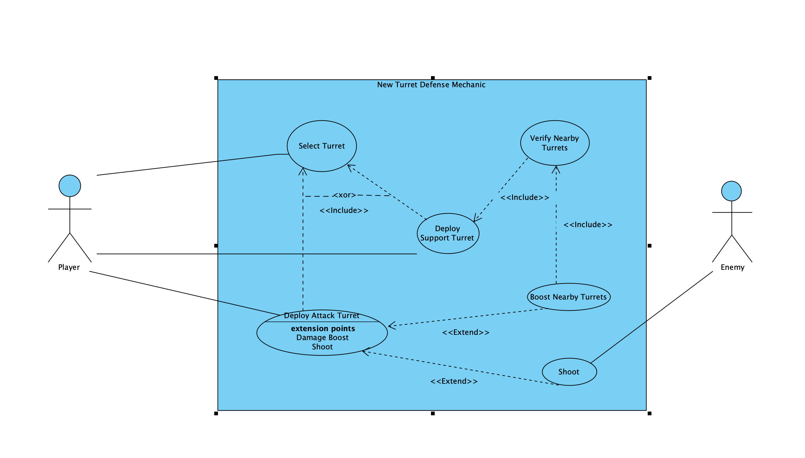

# User story 2
### New Turret Defense Mechanic
## Author(s)
 - Dinis Raleiras (67819)
 - Filipe Nobre (67850)
## Reviewer(s)
- Francisco Rodrigues (67753)
- Miguel Rosalino (68210)

## User Story:
*As an experienced player I want to have a greater diversity of towers so that it can help me automate the way I defend waves*
### Review
The use story follows a correct structure and the premise is relevant.

## Use case diagram

## Use case textual description

### UC1 – Select Turret
**Name** : Select Turret

**ID**: UC1

**Description**:

The player selects a turret type (attack or support) to deploy.

**Actors**

- **Primary**: Player

- **Secondary**: —

- **Preconditions** :
  - The player is in an active gameplay session.
  - The system is not paused.
   - The player has enough resources to build at least one turret type.
  
 - **Main Scenario**
    - The player opens the build menu.
    - The system displays available turret types.
    - The player selects a turret.
  
  - **Alternative Scenarios**

    - The selected turret is too expensive, system blocks the action and shows a warning.
  
 - **Postconditions**
   - A turret type is selected and ready for deployment.

### UC2 – Deploy Attack Turret
**Name** : Deploy Attack Turret

**ID**: UC2

**Description**:

The player places an attack turret on the map.

**Actors**

- **Primary**: Player

- **Secondary**: —

- **Preconditions** :
    - The player previously selected an attack turret (UC1).
    - The selected tile is valid for placement.
    - The player has enough resources to build the turret.
- **Main Scenario**
    - The player clicks or taps the desired location on the map.
    - The system validates the placement area.
    - The system creates the attack turret at the chosen location.
    - The turret initializes with base stats (health, damage, range).
    - The system adds the turret to the player's list of structures.

- **Alternative Scenarios**

    - The placement location is invalid, the system cancels the action.
    - The player lacks the required resources, the system shows an error.

- **Postconditions**
    - A functional attack turret is deployed and active on the map.

### UC3 – Deploy Support Turret
**Name** : Deploy Support Turret

**ID**: UC3

**Description**:

The player places a support turret that provides buffs to nearby structures.

**Actors**

- **Primary**: Player

- **Secondary**: —

- **Preconditions** :
    - The player previously selected a support turret (UC1).
    - The placement tile is valid.
    - The player has sufficient resources.

- **Main Scenario**
    - The player selects a location on the map.
    - The system checks if the location is valid.
    - The system creates the support turret.
    - The turret initializes with a default buff radius.

- **Alternative Scenarios**

  - The location is invalid, the system refuses the placement.
  - The player does not have enough resources.

- **Postconditions**
    - A support turret is deployed and ready to detect nearby turrets.

### UC4 – Verify Nearby Turrets
**Name** : Verify Nearby Turrets

**ID**: UC4

**Description**:

The support turret scans its surroundings to detect turrets within buff range.


**Actors**

- **Primary**: Support Turret

- **Secondary**: —

- **Preconditions** :
    - A support turret is active on the map.

- **Main Scenario**
    - The support turret periodically scans its buff radius.
    - The system calculates distances to nearby turrets.
    - The system creates a list of eligible turrets within range.

- **Alternative Scenarios**

  - No nearby turrets are detected, resulting in an empty list.

- **Postconditions**
    - A list of turrets within buff range is available for the boosting process.

### UC5 – Boost Nearby Turrets
**Name** : Boost Nearby Turrets

**ID**: UC5

**Description**:

The support turret applies temporary stat boosts to nearby turrets.

**Actors**

- **Primary**: Support Turret

- **Secondary**: Attack Turret

- **Preconditions** :
    - A list of nearby turrets is available (from UC4).

- **Main Scenario**
    - The system evaluates turrets within the buff radius.
    - The system applies temporary boosts (damage, fire rate, etc.).
    - Affected turrets update their stats while remaining in range.

- **Alternative Scenarios**

    - The support turret is destroyed, removing all active buffs.
    - A turret leaves the buff radius, ending its boosted state.

- **Postconditions**
    - Nearby turrets receive temporary enhancements if within range.


### UC6 – Shoot
**Name** : Shoot

**ID**: UC6

**Description**:

Attack turrets automatically fire at enemies within range.

**Actors**

- **Primary**: Attack Turret

- **Secondary**: Enemy

- **Preconditions** :
    - The turret is active and operational.
    - An enemy is within the turret’s shooting range.

- **Main Scenario**
    - The turret detects an enemy target.
    - The turret aims at the closest or highest-priority target.
    - The turret fires projectiles.
    - The system calculates projectile damage and effects.
    - Damage is applied to the enemy.

- **Alternative Scenarios**

    - No enemy is in range, the turret does not shoot.
    - The turret is out of ammo (if applicable).

- **Postconditions**
    - The enemy takes damage or is destroyed.


### Review

The use cases to develop are well chosen considering the user story. The main and alternative flows seem correct, and pre and post conditions too.
The actors described in the use cases however don't match the use case diagram. The Support Turret and Attack Turret actor are not present in the diagram.
The **includes** and **extends** relations make sense, but aren't explained in the use case descriptions. 
Overall, the use case descriptions are correct, but the diagram doesn't fully reflect them.


## Implementation documentation

### SupportBuffTower Class


`...\core\src\mindustry\world\blocks\defense\SuportBuffTower `

In order to implement the new turret defense mechanic, we created a new class called `SupportBuffTower`, which extends the existing `PowerBlock` class which extends the `Block` class. 
This class is responsible for providing buffs to nearby turrets within a specified radius.

#### Code Snippet
```java
package mindustry.world.blocks.defense;


import (...)

import static mindustry.Vars.tilesize;

public class SupportBuffTower extends PowerBlock {
    public final float buffRange = 60f;
    public final float baseDamageMultiplier = 2.5f;

    public SupportBuffTower(String name) {
        super(name);
        update = true;
        solid = true;
        hasPower = true;
        consumePower(1.2f);
        buildTime = 120f;
        health = 140;
    }

    @Override
    public void setStats(){
        super.setStats();

        stats.add(Stat.damageMultiplier, baseDamageMultiplier, StatUnit.none);
        stats.add(Stat.range, buffRange / Vars.tilesize, StatUnit.blocks);
    }

    @Override
    public void drawPlace(int x, int y, int rotation, boolean valid) {
        super.drawPlace(x, y, rotation, valid);
        Drawf.dashCircle(x * tilesize + offset, y * tilesize + offset, buffRange, Pal.accent);
    }

    public class SupportBuffBuild extends Building {
        float visualTimer = 60f;
        float pulseTimer = 0f;
        final float pulseDuration = 90f;

        @Override
        public void drawSelect() {
            Drawf.dashCircle(x, y, buffRange, Pal.accent);
        }

        @Override
        public void draw() {
            super.draw();
            if (efficiency <= 0f) return;
            float radius = Mathf.lerp(0, buffRange, pulseTimer);
            float alpha = 0.7f * Mathf.curve(pulseTimer, 0f, 0.5f) * (1f - pulseTimer);
            Lines.stroke(3f * (1f - pulseTimer));
            Draw.color(Pal.accent, alpha);
            Lines.circle(x, y, radius);
            Draw.reset();
        }

        @Override
        public void updateTile() {
            super.updateTile();

            if (efficiency <= 0f) return;
            visualTimer += Time.delta;

            pulseTimer += Time.delta / pulseDuration;
            if (pulseTimer >= 1f) {
                pulseTimer = 0f;
            }

            applyDamageBoost();
        }

        void applyDamageBoost() {
            if (efficiency <= 0) return;

            float pulseRadius = Mathf.lerp(0, buffRange, pulseTimer);
            float tolerance = 0.2f;

            Vars.indexer.eachBlock(
                    this.team,
                    this.x,
                    this.y,
                    buffRange,
                    b -> b instanceof Turret.TurretBuild,
                    b -> {
                        Turret.TurretBuild turret = (Turret.TurretBuild) b;

                        // calcula distância do centro do buff até a torre
                        float dist = Mathf.dst(x, y, turret.x, turret.y);

                        // se o pulso "atingiu" a torre
                        if (dist >= pulseRadius - tolerance && dist <= pulseRadius + tolerance) {

                            // Efeito visual
                            Fx.sparkExplosion.at(turret.x, turret.y, 0, Pal.accent);
                        }
                        // Aplica buff
                        turret.supportDamageMultiplier = baseDamageMultiplier;
                    }
            );
        }

    }
}
```
##### Methods

- `setStats()`: Sets the statistics for the support buff tower, including damage multiplier and buff range.
- `drawPlace(int x, int y, int rotation, boolean valid)`: Draws the placement indicator for the tower, including the buff range circle. Use Case: `UC3`
- `SupportBuffBuild` class: Inner class that represents the building instance of the support buff tower.
  - `drawSelect()`: Draws the selection indicator for the tower.
  - `draw()`: Handles the visual effects of the tower, including the pulsing buff effect.
  - `updateTile()`: Updates the tower's state, including applying damage boosts to nearby turrets. Use Case : `UC6`
  - `applyDamageBoost()`: Applies the damage boost to turrets within the buff range when the pulse reaches them. Use Case: `UC4`, `UC5`

### Turret Class

`...\core\src\mindustry\world\blocks\defense\turrets\Turret `

#### Changed `shoot` `UC6` method and `supportDamageMultiplier` variable
```java
(...) 
public float supportDamageMultiplier = 1f;

(...)
BulletType buffedType = type.copy();
buffedType.damage *= supportDamageMultiplier;
(...)
```


This prevent turret damage from scaling permanently, the bullet type is copied during the shooting process.
This ensures that:
 - The original `BulletType` remains unchanged
 - The damage multiplier applies only to the current shot
 - No exponential or persistent damage boosts occur across multiple shots
 - Other turrets using the same bullet type are not affected

### Added resetSupportMultiplier()

``` java
 public void resetSupportMultiplier() {
            supportDamageMultiplier = 1f;
        }
```
This method is called in the end of the `updateTile` method.

Calling resetSupportMultiplier() at the end of updateTile() ensures that each turret:
- Starts every tick with a default multiplier of 1f
- Only receives the buff if a SupportBuffTower is in range during that tick
- Never keeps the buff permanently
- Does not accumulate or stack damage boosts across updates
- This guarantees consistent, non-persistent buff behavior and prevents unintended damage scaling.

### Block Class

`...\core\src\mindustry\content\Block `

#### Initialization of `supportBuffTower`

Use Cases: `UC1`, `UC3`

```java
supportBuffTower = new SupportBuffTower("support-buff-tower") {{
    requirements(Category.turret, with(Items.copper, 200, Items.lead, 150, Items.silicon, 100));
    size = 1;
    update = true;
}};
```
This defines the necessary resources for the construction of the Support Buff Tower.

### Package support-buff-tower

`\...\core\assets-raw\sprites\blocks\turrets\suppport-buff-tower`

(*Sprites and visual assets for the Support Buff Tower.*)


**This Represents the image of out tower.**


### Language Descriptions

`...\core\assets\bundles\bundle.properties`

``` properties
(...)
block.support-buff-tower.name = Advance Support Tower
(...)
block.support-buff-tower.description = Boost the damage of the nearby towers.
(...)
```

**This adds the name and description of the tower in the game.**


### Implementation summary
We have made changes throughout the codebase to implement the new turret defense mechanic.
The main addition is the `SupportBuffTower` class, which handles the logic for buffing nearby turrets.
Other changes include modifications to the `Turret` class to accommodate the damage boost functionality.
We also created new assets for the tower and updated the language files to include the tower's name and description.
#### Review
*(Please add your implementation summary review here)*

### Class diagrams
(*Class diagrams and their discussion in natural language.*)
### Review
*(Please add your class diagram review here)*

### Sequence diagrams
(*Sequence diagrams and their discussion in natural language.*)
#### Review
*(Please add your sequence diagram review here)*

## Test specifications
(*Test cases specification and pointers to their implementation, where adequate.*)
### Review
*(Please add your test specification review here)*
